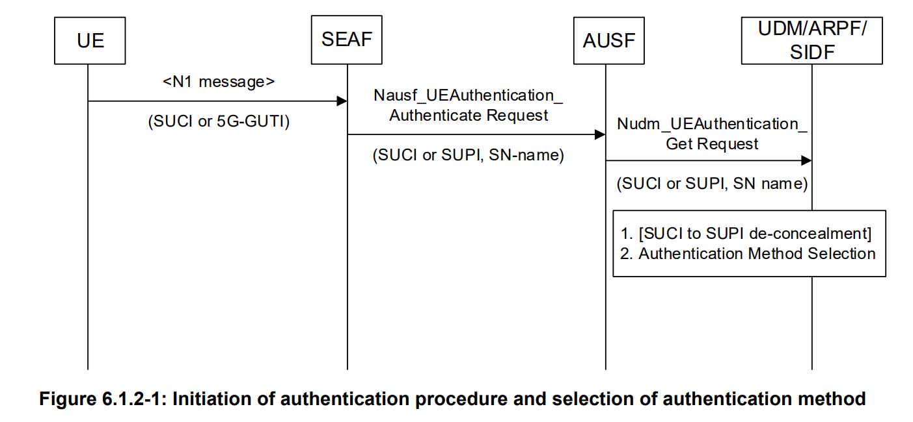
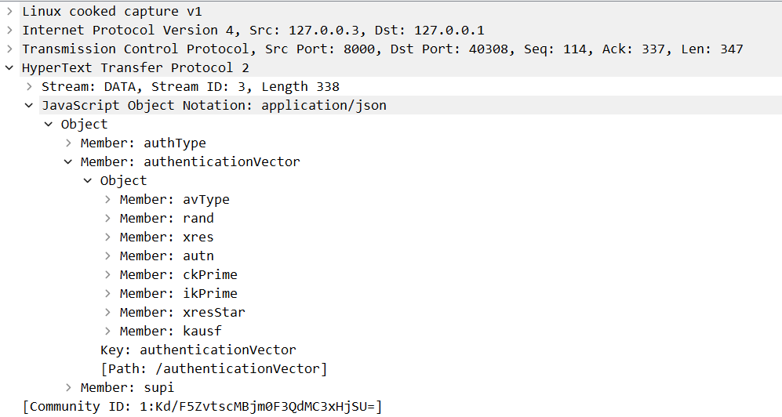
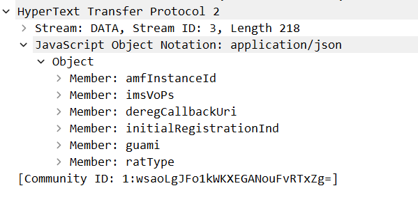
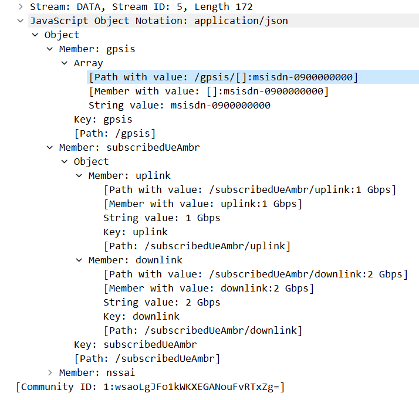
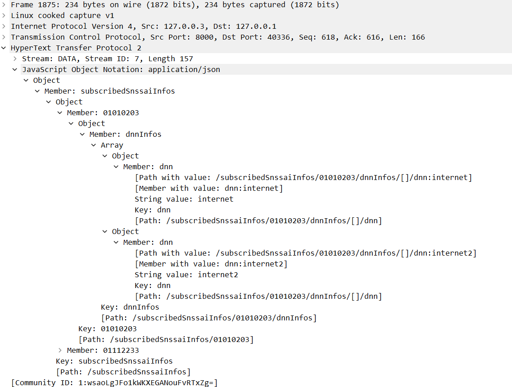

# Network function UDM introduction

>[!NOTE]
> Author: 張哲睿
> Date: 2023/7/19

### Overview
In this article, I will introduce UDM and its three services that will be used in the general UE registration procedure (Nudm_UECM service, Nudm_SubscriberDataManagement Service, and Nudm_UEAuthentication service) to let everyone understand UDM more clearly.

### UDM
Unified Data Management is responsible for managing information related to UE. When other NFs need to use the UE subscription information, they will obtain it from UDM through the SBI of UDM.

### Nudm_UEAuthentication Service
This service is used by AUSF to retrieve authentication-related information and, after authentication, confirm the result.


>[3GPP TS33.501 v15.2.0](https://www.etsi.org/deliver/etsi_ts/133500_133599/133501/15.02.00_60/ts_133501v150200p.pdf)

In Authentication, AUSF uses the GET operation to retrieve authentication information for the UE. The request contains the UE’s identity (supi or suci) and the serving network name. The serving network name is used in the derivation of the anchor key, which is used by subsensual authentication. UE’s identity will be contained in the URI, and the serving network name will be contained in the request body.

Upon reception of the Nudm_UEAuthentication_Get Request, the UDM shall de-conceal SUCI to gain SUPI if SUCI is received. At this time, UDM will query the authentication subscription data from UDR. Then, UDM shall select the authentication method based on SUPI, and if required (e.g., 5G-AKA), UDM will calculate the authentication vector and pass it to AUSF.

* SUPI: A globally unique 5G Subscription Permanent Identifier, used to identify UE.
* SUCI: Subscription concealed identifier, obtained by encrypting supi through the Home Network Public Key so that supi will not be obtained by a third party on the network.

```golang
logger.UeauLog.Traceln("In GenerateAuthDataProcedure")

response = &models.AuthenticationInfoResult{}
rand.Seed(time.Now().UnixNano())
supi, err := suci.ToSupi(supiOrSuci, udm_context.Getself().SuciProfiles)
if err != nil {
    problemDetails = &models.ProblemDetails{
        Status: http.StatusForbidden,
        Cause:  authenticationRejected,
        Detail: err.Error(),
    }

    logger.UeauLog.Errorln("suciToSupi error: ", err.Error())
    return nil, problemDetails
}

logger.UeauLog.Tracef("supi conversion => [%s]", supi)

client, err := createUDMClientToUDR(supi)
if err != nil {
    return nil, openapi.ProblemDetailsSystemFailure(err.Error())
}
authSubs, res, err := client.AuthenticationDataDocumentApi.QueryAuthSubsData(context.Background(), supi, nil)

//in the udm/internal/sbi/producer/generate_auth_data.go, GenerateAuthDataProcedure function.
```

From the code, we can see UDM first de-conceal SUCI (line 5), then use QueryAuthSubsData to get authSub from UDR. After that, UDM uses this information to create the authentication vector.

Then we record the packet sent in the registration process and find the packet according to the URI specified by the specification. We can find the packet corresponding to this service.


Open the response packet, and we can see the response body matches the AuthenticationInfoResult data type.




>[3GPP TS29.503 v15.2.1](https://www.etsi.org/deliver/etsi_ts/129500_129599/129503/15.02.01_60/ts_129503v150201p.pdf)

After AUSF authenticates the UE, it will confirm the result with UDM. These details will be used in linking authentication confirmation to the Nudm_UECM_Registration procedure from AMF.

```golang
func communicateWithUDM(ue *context.AmfUe, accessType models.AccessType) error {
	ue.GmmLog.Debugln("communicateWithUDM")
	amfSelf := context.GetSelf()

	// UDM selection described in TS 23.501 6.3.8
	// TODO: consider udm group id, Routing ID part of SUCI, GPSI or External Group ID (e.g., by the NEF)
	param := Nnrf_NFDiscovery.SearchNFInstancesParamOpts{
		Supi: optional.NewString(ue.Supi),
	}
	resp, err := consumer.SendSearchNFInstances(amfSelf.NrfUri, models.NfType_UDM, models.NfType_AMF, &param)
	if err != nil {
		return errors.Errorf("AMF can not select an UDM by NRF: SendSearchNFInstances failed")
	}

	var uecmUri, sdmUri string
	for _, nfProfile := range resp.NfInstances {
		ue.UdmId = nfProfile.NfInstanceId
		uecmUri = util.SearchNFServiceUri(nfProfile, models.ServiceName_NUDM_UECM, models.NfServiceStatus_REGISTERED)
		sdmUri = util.SearchNFServiceUri(nfProfile, models.ServiceName_NUDM_SDM, models.NfServiceStatus_REGISTERED)
		if uecmUri != "" && sdmUri != "" {
			break
		}
	}
	ue.NudmUECMUri = uecmUri
	ue.NudmSDMUri = sdmUri
	if ue.NudmUECMUri == "" || ue.NudmSDMUri == "" {
		return errors.Errorf("AMF can not select an UDM by NRF: SearchNFServiceUri failed")
	}

	problemDetails, err := consumer.UeCmRegistration(ue, accessType, true)
	if problemDetails != nil {
		return errors.Errorf(problemDetails.Cause)
	} else if err != nil {
		return errors.Wrap(err, "UECM_Registration Error")
	}

	// TS 23.502 4.2.2.2.1 14a-c.
	// "After a successful response is received, the AMF subscribes to be notified
	// 		using Nudm_SDM_Subscribe when the data requested is modified"
	problemDetails, err = consumer.SDMGetAmData(ue)
	if problemDetails != nil {
		return errors.Errorf(problemDetails.Cause)
	} else if err != nil {
		return errors.Wrap(err, "SDM_Get AmData Error")
	}

	problemDetails, err = consumer.SDMGetSmfSelectData(ue)
	if problemDetails != nil {
		return errors.Errorf(problemDetails.Cause)
	} else if err != nil {
		return errors.Wrap(err, "SDM_Get SmfSelectData Error")
	}

	problemDetails, err = consumer.SDMGetUeContextInSmfData(ue)
	if problemDetails != nil {
		return errors.Errorf(problemDetails.Cause)
	} else if err != nil {
		return errors.Wrap(err, "SDM_Get UeContextInSmfData Error")
	}

	problemDetails, err = consumer.SDMSubscribe(ue)
	if problemDetails != nil {
		return errors.Errorf(problemDetails.Cause)
	} else if err != nil {
		return errors.Wrap(err, "SDM Subscribe Error")
	}
	ue.ContextValid = true
	return nil
}


//in the amf/internal/gmm/handler.go.
```

Next, let's take a look at this function. It is called in HandleInitialRegistration, which handles UE's initial registration. UeCmRegistration will use the Nudm_UECM (UECM) service to store related UE Context Management information in UDM. In lines 40, 47, and 54, AMF uses the Nudm_SubscriberDataManagement (SDM) Service to get some subscribe data.

### Nudm_UEContextManagement Service 
In the UeCmRegistration function, AMF registers as UE's serving NF on UDM and stores related UE Context Management information in UDM. Looking at the packet, you can see that the request body contains `amfInstanceId` and `guami`, representing the amf identity, and `ratType`, representing the radio access technology type used by UE.

 

```golang
// TS 29.503 5.3.2.2.2
func RegistrationAmf3gppAccessProcedure(registerRequest models.Amf3GppAccessRegistration, ueID string) (
	header http.Header, response *models.Amf3GppAccessRegistration, problemDetails *models.ProblemDetails,
) {
	// TODO: EPS interworking with N26 is not supported yet in this stage
	var oldAmf3GppAccessRegContext *models.Amf3GppAccessRegistration
	if udm_context.Getself().UdmAmf3gppRegContextExists(ueID) {
		ue, _ := udm_context.Getself().UdmUeFindBySupi(ueID)
		oldAmf3GppAccessRegContext = ue.Amf3GppAccessRegistration
	}

	udm_context.Getself().CreateAmf3gppRegContext(ueID, registerRequest)

	clientAPI, err := createUDMClientToUDR(ueID)
	if err != nil {
		return nil, nil, openapi.ProblemDetailsSystemFailure(err.Error())
	}

	var createAmfContext3gppParamOpts Nudr_DataRepository.CreateAmfContext3gppParamOpts
	optInterface := optional.NewInterface(registerRequest)
	createAmfContext3gppParamOpts.Amf3GppAccessRegistration = optInterface
	resp, err := clientAPI.AMF3GPPAccessRegistrationDocumentApi.CreateAmfContext3gpp(context.Background(),
		ueID, &createAmfContext3gppParamOpts)
	if err != nil {
		logger.UecmLog.Errorln("CreateAmfContext3gpp error : ", err)
		problemDetails = &models.ProblemDetails{
			Status: int32(resp.StatusCode),
			Cause:  err.(openapi.GenericOpenAPIError).Model().(models.ProblemDetails).Cause,
			Detail: err.Error(),
		}
		return nil, nil, problemDetails
	}
	defer func() {
		if rspCloseErr := resp.Body.Close(); rspCloseErr != nil {
			logger.UecmLog.Errorf("CreateAmfContext3gpp response body cannot close: %+v", rspCloseErr)
		}
	}()

	// TS 23.502 4.2.2.2.2 14d: UDM initiate a Nudm_UECM_DeregistrationNotification to the old AMF
	// corresponding to the same (e.g. 3GPP) access, if one exists
	if oldAmf3GppAccessRegContext != nil {
		deregistData := models.DeregistrationData{
			DeregReason: models.DeregistrationReason_SUBSCRIPTION_WITHDRAWN,
			AccessType:  models.AccessType__3_GPP_ACCESS,
		}
		callback.SendOnDeregistrationNotification(ueID, oldAmf3GppAccessRegContext.DeregCallbackUri,
			deregistData) // Deregistration Notify Triggered

		return nil, nil, nil
	} else {
		header = make(http.Header)
		udmUe, _ := udm_context.Getself().UdmUeFindBySupi(ueID)
		header.Set("Location", udmUe.GetLocationURI(udm_context.LocationUriAmf3GppAccessRegistration))
		return header, &registerRequest, nil
	}
}

//in the udm/internal/sbi/producer/ue_context_management.go
```

In the RegistrationAmf3gppAccessProcedure function, UDM first checks whether the context has been established for that UE; if UDM has such a context, it initiates a Nudm_UECM_DeregistrationNotification to the old AMF later. UDM used the received information to create context and stored it in UDR.


### Nudm_SubscriberDataManagement (SDM) Service
The SDM service is used to retrieve the UE's individual subscription data relevant to the consumer's NF from the UDM. In the SDMGetAmData function, AMF gets subscription data used in registration and mobility management. In the response packet, AMF got `gpsis`, `subscribedUeAmbr`, and `nssai`.



The GPSI (Generic Public Subscription Identifier) is used to address a 3GPP subscription in data networks outside the realms of a 3GPP system. It contains either an External ID or an [MSISDN](https://en.wikipedia.org/wiki/MSISDN) （Mobile Subscriber ISDN Number）.The `subscribedUeAmbr` is The Maximum Aggregated uplink and downlink MBRs (max. bit rate) to be shared across all Non-GBR (non-guaranteed Bit Rate) QoS Flows according to the subscription of the user.



In the SDMGetSmfSelectData function, AMF gets subscribed S-NSSAIs (Single Network Slice Selection Assistance Information) and Data Network Names for these S-NSSAIs. AMF will use this information to select an SMF that manages the PDU Session.

```golang
func HandleInitialRegistration(ue *context.AmfUe, anType models.AccessType) error {
	ue.GmmLog.Infoln("Handle InitialRegistration")

	amfSelf := context.GetSelf()

	// update Kgnb/Kn3iwf
	ue.UpdateSecurityContext(anType)

	// Registration with AMF re-allocation (TS 23.502 4.2.2.2.3)
	if len(ue.SubscribedNssai) == 0 {
		getSubscribedNssai(ue)
	}

	if err := handleRequestedNssai(ue, anType); err != nil {
		return err
	}

//in the amf/internal/gmm/handler.go.
```

In the initialization of HandleInitialRegistration, AMF sends a request to the UDM to receive the UE's NSSAI (Network Slice Selection Assistance Information). After receiving subscribed NSSAI, AMF will compare it to UE's requested NSSAI. If there is a S-NSSAI that has not been subscribed before, AMF will request NSSF for Allowed NSSAI.

```golang
func handleRequestedNssai(ue *context.AmfUe, anType models.AccessType) error {
	amfSelf := context.GetSelf()

	if ue.RegistrationRequest.RequestedNSSAI != nil {
		requestedNssai, err := nasConvert.RequestedNssaiToModels(ue.RegistrationRequest.RequestedNSSAI)
		if err != nil {
			return fmt.Errorf("Decode failed at RequestedNSSAI[%s]", err)
		}

		needSliceSelection := false
		for _, requestedSnssai := range requestedNssai {
			ue.GmmLog.Infof("RequestedNssai - ServingSnssai: %+v, HomeSnssai: %+v",
				requestedSnssai.ServingSnssai, requestedSnssai.HomeSnssai)
			if ue.InSubscribedNssai(*requestedSnssai.ServingSnssai) {
				allowedSnssai := models.AllowedSnssai{
					AllowedSnssai: &models.Snssai{
						Sst: requestedSnssai.ServingSnssai.Sst,
						Sd:  requestedSnssai.ServingSnssai.Sd,
					},
					MappedHomeSnssai: requestedSnssai.HomeSnssai,
				}
				if !ue.InAllowedNssai(*allowedSnssai.AllowedSnssai, anType) {
					ue.AllowedNssai[anType] = append(ue.AllowedNssai[anType], allowedSnssai)
				}
			} else {
				needSliceSelection = true
				break
			}
		}

		if needSliceSelection {
			if ue.NssfUri == "" {
				for {
					err := consumer.SearchNssfNSSelectionInstance(ue, amfSelf.NrfUri, models.NfType_NSSF, models.NfType_AMF, nil)
					if err != nil {
						ue.GmmLog.Errorf("AMF can not select an NSSF Instance by NRF[Error: %+v]", err)
						time.Sleep(2 * time.Second)
					} else {
						break
					}
				}
			}

			// Step 4
			problemDetails, err := consumer.NSSelectionGetForRegistration(ue, requestedNssai)
			if problemDetails != nil {
				ue.GmmLog.Errorf("NSSelection Get Failed Problem[%+v]", problemDetails)
				gmm_message.SendRegistrationReject(ue.RanUe[anType], nasMessage.Cause5GMMProtocolErrorUnspecified, "")
				return fmt.Errorf("Handle Requested Nssai of UE failed")
			} else if err != nil {
				ue.GmmLog.Errorf("NSSelection Get Error[%+v]", err)
				gmm_message.SendRegistrationReject(ue.RanUe[anType], nasMessage.Cause5GMMProtocolErrorUnspecified, "")
				return fmt.Errorf("Handle Requested Nssai of UE failed")
			}

//in the amf/internal/gmm/handler.go.
```


```golang
if param.SliceInfoRequestForRegistration.RequestedNssai != nil &&
	len(param.SliceInfoRequestForRegistration.RequestedNssai) != 0 {
	// Requested NSSAI is provided
	// Verify which S-NSSAI(s) in the Requested NSSAI are permitted based on comparing the Subscribed S-NSSAI(s)
	if param.Tai != nil &&
		!util.CheckSupportedNssaiInPlmn(param.SliceInfoRequestForRegistration.RequestedNssai, *param.Tai.PlmnId) {
		// Return ProblemDetails indicating S-NSSAI is not supported
		// TODO: Based on TS 23.501 V15.2.0, if the Requested NSSAI includes an S-NSSAI that is not valid in the
		//       Serving PLMN, the NSSF may derive the Configured NSSAI for Serving PLMN
		*problemDetails = models.ProblemDetails{
			Title:  util.UNSUPPORTED_RESOURCE,
			Status: http.StatusForbidden,
			Detail: "S-NSSAI in Requested NSSAI is not supported in PLMN",
			Cause:  "SNSSAI_NOT_SUPPORTED",
		}

		status = http.StatusForbidden
		return status
	}

	// Check if any Requested S-NSSAIs is present in Subscribed S-NSSAIs
	checkIfRequestAllowed := false

	for _, requestedSnssai := range param.SliceInfoRequestForRegistration.RequestedNssai {
		if param.Tai != nil && !util.CheckSupportedSnssaiInTa(requestedSnssai, *param.Tai) {
			// Requested S-NSSAI does not supported in UE's current TA
			// Add it to Rejected NSSAI in TA
			authorizedNetworkSliceInfo.RejectedNssaiInTa = append(
				authorizedNetworkSliceInfo.RejectedNssaiInTa,
				requestedSnssai)
			continue
		}

		var mappingOfRequestedSnssai models.Snssai
		// TODO: Compared with Restricted S-NSSAI list in configuration under roaming scenario
		if param.HomePlmnId != nil && !util.CheckStandardSnssai(requestedSnssai) {
			// Standard S-NSSAIs are supported to be commonly decided by all roaming partners
			// Only non-standard S-NSSAIs are required to find mappings
			targetMapping, found := util.FindMappingWithServingSnssai(requestedSnssai,
				param.SliceInfoRequestForRegistration.MappingOfNssai)

			if !found {
				// No mapping of Requested S-NSSAI to HPLMN S-NSSAI is provided by UE
				// TODO: Search for local configuration if there is no provided mapping from UE, and update UE's
				//       Configured NSSAI
				checkInvalidRequestedNssai = true
				authorizedNetworkSliceInfo.RejectedNssaiInPlmn = append(
					authorizedNetworkSliceInfo.RejectedNssaiInPlmn,
					requestedSnssai)
				continue
			} else {
				// TODO: Check if mappings of S-NSSAIs are correct
				//       If not, update UE's Configured NSSAI
				mappingOfRequestedSnssai = *targetMapping.HomeSnssai
			}
		} else {
			mappingOfRequestedSnssai = requestedSnssai
		}

		hitSubscription := false
		for _, subscribedSnssai := range param.SliceInfoRequestForRegistration.SubscribedNssai {
			if mappingOfRequestedSnssai == *subscribedSnssai.SubscribedSnssai {
				// Requested S-NSSAI matches one of Subscribed S-NSSAI
				// Add it to Allowed NSSAI list
				hitSubscription = true

				var allowedSnssaiElement models.AllowedSnssai
				allowedSnssaiElement.AllowedSnssai = new(models.Snssai)
				*allowedSnssaiElement.AllowedSnssai = requestedSnssai
				nsiInformationList := util.GetNsiInformationListFromConfig(requestedSnssai)
				if nsiInformationList != nil {
					// TODO: `NsiInformationList` should be slice in `AllowedSnssai` instead of pointer of slice
					allowedSnssaiElement.NsiInformationList = append(
						allowedSnssaiElement.NsiInformationList,
						nsiInformationList...)
				}
				if param.HomePlmnId != nil && !util.CheckStandardSnssai(requestedSnssai) {
					allowedSnssaiElement.MappedHomeSnssai = new(models.Snssai)
					*allowedSnssaiElement.MappedHomeSnssai = *subscribedSnssai.SubscribedSnssai
				}

				// Default Access Type is set to 3GPP Access if no TAI is provided
				// TODO: Depend on operator implementation, it may also return S-NSSAIs in all valid Access Type if
				//       UE's Access Type could not be identified
				var accessType models.AccessType = models.AccessType__3_GPP_ACCESS
				if param.Tai != nil {
					accessType = util.GetAccessTypeFromConfig(*param.Tai)
				}

				util.AddAllowedSnssai(allowedSnssaiElement, accessType, authorizedNetworkSliceInfo)

				checkIfRequestAllowed = true
				break
			}
		}

		if !hitSubscription {
			// Requested S-NSSAI does not match any Subscribed S-NSSAI
			// Add it to Rejected NSSAI in PLMN
			checkInvalidRequestedNssai = true
			authorizedNetworkSliceInfo.RejectedNssaiInPlmn = append(
				authorizedNetworkSliceInfo.RejectedNssaiInPlmn,
				requestedSnssai)
		}
	}

	if !checkIfRequestAllowed {
		// No S-NSSAI from Requested NSSAI is present in Subscribed S-NSSAIs
		// Subscribed S-NSSAIs marked as default are used
		useDefaultSubscribedSnssai(param, authorizedNetworkSliceInfo)
	}
} else {
	// No Requested NSSAI is provided
	// Subscribed S-NSSAIs marked as default are used
	checkInvalidRequestedNssai = true
	useDefaultSubscribedSnssai(param, authorizedNetworkSliceInfo)
}

//in the nssf/internal/sbi/producer/nsselection_for_registration.go, nsselectionForRegistration funcion.
```

If NSSF needs to select S-NSSAI, it first finds the mapping of requested NSSAI to configured NSSAI for the HPLMN and converts requested S-NSSAI to S-NSSAI in configured NSSAI for the HPLMN. Then compare these S-NSSAIs with Subscribed S-NSSAIs; if NSSF find one match, set it as `AllowedSnssai`. If NSSF can't find such a mapping or no S-NSSAI in the mapping matches subscribed S-NSSAIs, it will use default subscribed S-NSSAIs.

### Reference
* [3GPP TS29.503 v15.2.1](https://www.etsi.org/deliver/etsi_ts/129500_129599/129503/15.02.01_60/ts_129503v150201p.pdf)
* [3GPP TS23.502 v15.2.0](https://www.etsi.org/deliver/etsi_ts/123500_123599/123502/15.02.00_60/ts_123502v150200p.pdf)
* [3GPP TS23.501 v15.2.0](https://www.etsi.org/deliver/etsi_ts/123500_123599/123501/15.02.00_60/ts_123501v150200p.pdf)
* [3GPP TS33.501 v15.2.0](https://www.etsi.org/deliver/etsi_ts/133500_133599/133501/15.02.00_60/ts_133501v150200p.pdf)
* [free5GC v3.3.0](https://github.com/free5gc/free5gc)

### About
Hello! My name is 張哲睿, and my current research topic is ATSSS (Access Traffic Steering, Switching and Splitting), I will continue to write articles related to 5G networks in the future. If you find any mistakes in my articles or have any topics you want to know about, please contact me.

* [Linkedln](https://www.linkedin.com/in/%E5%93%B2%E7%9D%BF-%E5%BC%B5-77096621a/)
