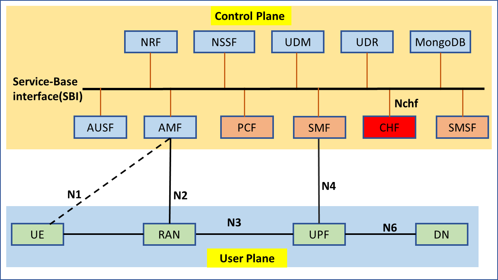
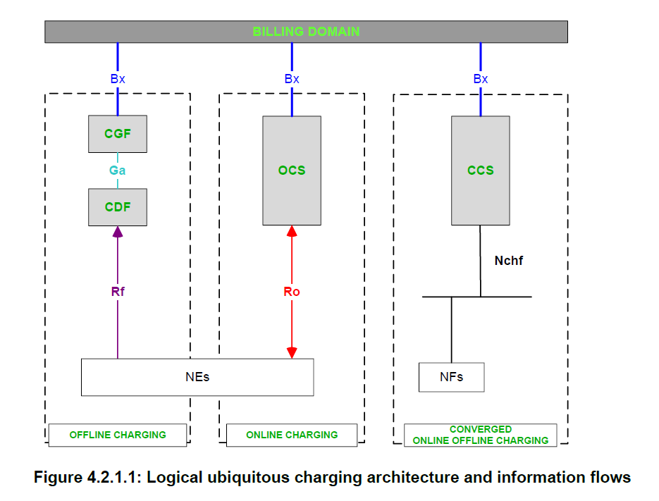
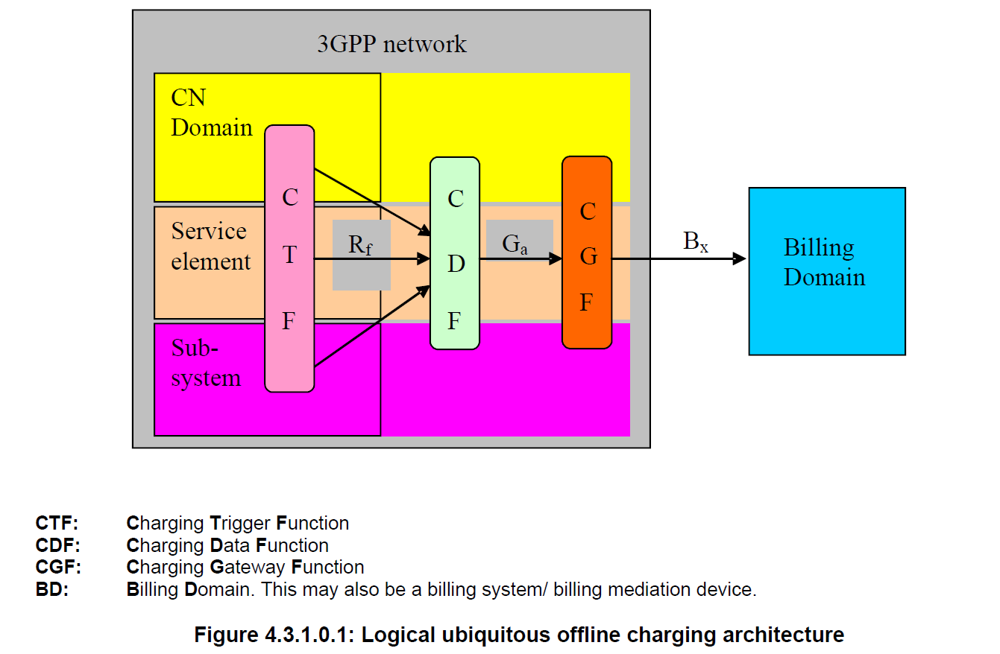
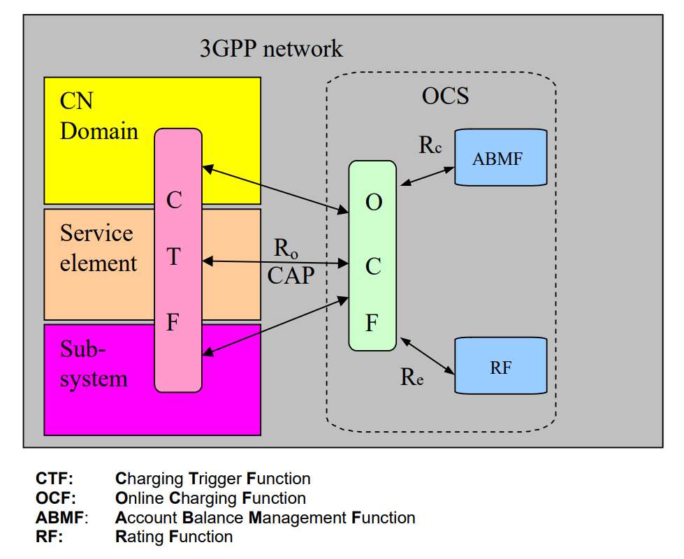
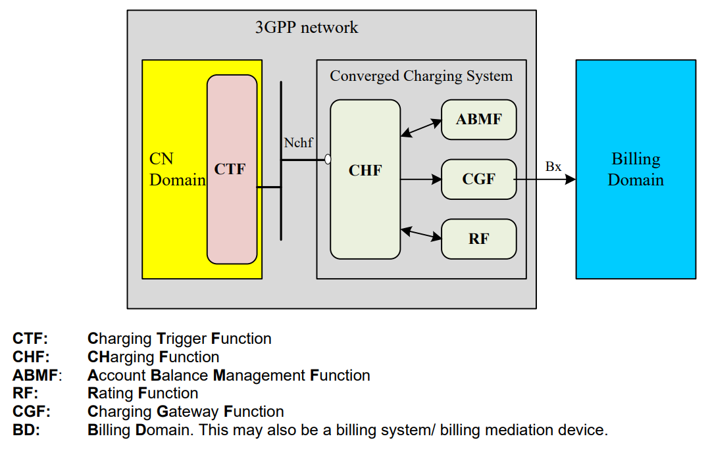
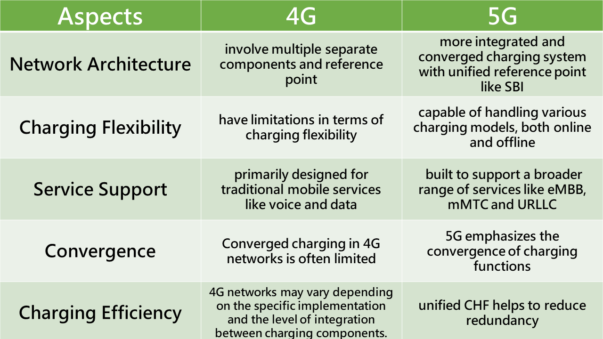

# CHarging Function(CHF) Overview

>[!NOTE]
> Author: Benson Hsu
> Date: 2023/9/13

The `charging function` is a crucial component of the 5G core network responsible for tasks such as `traffic calculation and quota management`. For network providers and administrators, it is one of the most critical network elements. This article will explain the fundamental concepts and mechanisms of charging, as well as highlight the differences between 4G and 5G charging. Finally, we will include information about the CHF implementation developed by the free5GC team.

## Charging Mechanisms
The charging system can be divided into three main types: offline charging, online charging, and converged charging:

* **Offline Charging**:

    * **After network resource usage**, charging information is transmitted from the network to the Billing Domain (BD).
    * The Billing Domain is responsible for performing cost calculations and data statistics.

* **Online Charging**:

    * **Before network resource usage**, the network sends an authentication request to the Online Charging System (OCS).
    * The OCS queries the subscriber's account information to determine whether the usage of these resources is allowed.
    * After receiving authentication from the OCS, resource usage is monitored, and related account information is stored in the OCS.

* **Converged Charging**:

    * Converged charging is a mechanism that combines both online and offline charging.
    * **For example, the CHF (Converged Charging Function) architecture in the 5G core system is an example of converged charging**.
    * In other service systems, if the charging system includes both offline and online charging functionalities, it can also be referred to as converged charging.

Typical triggers for charging related to **network resource usage include**:

* A voice call of a certain duration.
* The transport of a certain volume of data.
* The submission of a multimedia message (MM) of a certain size.

> Resource usage requests can be triggered by the UE  or by the core network. Furthermore, for the same chargeable event, both offline and online charging can occur simultaneously and independently.

## High Level Common Architecture

The diagram below is from [3GPP TS32.240-V15.5.0](https://www.tech-invite.com/3m32/toc/tinv-3gpp-32-240_c.html#e-4-2), which illustrates the architectural differences among the three charging systems and indicates through which reference points data is transmitted for each Network Element (NE).

---
### Offline Charging Function

The **Offline Charging Function** primarily consists of three components: **CTF** (Charging Trigger Function), **CDF** (Charging Data Function), and **CGF** (Charging Gateway Function). Here's an overview of the roles of each function and how data flows between them:

1. **CTF (Charging Trigger Function):**
   - **Role:** CTF is responsible for generating charging events by observing network resource usage.
   - **Data Flow:** It collects information about trigger conditions, information elements to be collected, and which service events, signaling, or user traffic to monitor.
   - **Data Transfer:** CTF forwards generated charging events to CDF.

2. **CDF (Charging Data Function):**
   - **Role:** CDF receives charging events from CTF and processes them.
   - **Data Flow:** It processes and stores charging data, potentially performing reformatting to comply with specific formats.
   - **Data Transfer:** CDF sends the processed Charging Data Records (CDRs) to CGF.

3. **CGF (Charging Gateway Function):**
   - **Role:** CGF is responsible for persistent CDR storage, preparing CDR files, and transferring them to the Billing Domain (BD).
   - **Data Flow:** It provides storage for CDRs and manages the routing of CDR files.
   - **Data Transfer:** CGF transfers CDR files to the Billing Domain via the Bx reference point.

These functions work together to collect, process, and store charging data in the offline charging system.

---
### Online Charging Functions(OCF)

The **Online Charging Function** primarily consists of four components: **CTF** (Charging Trigger Function), **OCF** (Online Charging Function), **ABMF** (Account Balance Management Function), and **RF** (Rating Function). Here's an overview of the roles of each function and how data flows between them:

1\. **CTF (Charging Trigger Function):**
   * **Role:** CTF observes network resource usage to generate charging events.
   * **Data Flow:** It collects information about trigger conditions, information elements to be collected, and the monitoring of service events, signaling, or user traffic.
   * **Data Transfer:** CTF forwards generated charging events to the OCF.

2\. **OCF (Online Charging Function):**
   * **Role:** OCF is responsible for real-time charging and authorization of resource usage.
   * **Data Flow:** It evaluates charging events, determines the value of requested resource usage, and authorizes it.
   * **Data Transfer:** OCF sends authorization information to the network element, which then executes the resource usage.

3\. **ABMF (Account Balance Management Function):**
   * **Role:** ABMF manages subscriber account balances and credit control.
   * **Data Flow:** It keeps track of subscriber account balances and interacts with OCF for authorization and debiting.
   * **Data Transfer:** ABMF communicates with OCF to manage subscriber balances during resource usage.

4\. **RF (Rating Function):**
   * **Role:** RF determines the value or amount of actual network resource usage for OCF (according to OCF from charging event)
   * **Data Flow:** The OCF provides the RF with essential data extracted from the charging event. Then RF returns the rating results, which can be in the form of monetary or non-monetary units.
   * **Data Transfer:** OCF send charging event to RF, and RF return rating results in specific unit

These functions collaborate to enable real-time online charging, authorization, and account management for subscribers in the online charging system.

---
### Converged Charging Functions

The **Converged Charging Functions** consist of various components, each with specific roles and data flow within the system. Here's an overview of the roles of each function and how data flows between them:

1\. **CTF (Charging Trigger Function):**
   * **Role:** CTF is mostly integrated into network functions like PCF, SMSF, and SMF. These network functions monitor charging information and transform it into charging events, which are then forwarded to the CHF for further processing.
   * **Data Flow:** It collects information on trigger conditions, information elements to be captured, and monitors service events, signaling, or user traffic.
   * **Data Transfer:** The CTF forwards the generated charging events to the CHF via an SBI (Service-Based Interface) located within the core network's control plane.

2\. **CHF (CHarging Function):**
   * **Role:** CHF is responsible for facilitating communication among all functions within the Converged Charging System(CCS). Its role includes receiving charging events and generating CDRs (Charging Data Records). Importantly, it can simultaneously handle both online and offline charging functions.
   * **Data Flow:** It evaluates charging events, determines the value of requested resource usage, authorizes it, and manages subscriber account balances.
   * **Data Transfer:** CHF and its associated functions engage in data exchanges involving various types of information. These data exchanges include charging events, user count balances, CDRs (Charging Data Records), and rating information.

>The remaining functions mentioned earlier in the descriptions of offline and online charging serve the same purposes and functions, so we won't go into further detail here.

## The Differences between 4G and 5G Charging
In the 4G era, various concepts and functions for online and offline charging were already established. When defining the 5G standards, it was recognized that there was a need to support various charging methods. Therefore, a new function called CHF (Charging Function) was introduced, and other functions such as ABMF, CGF, and RF from different systems were integrated into the Converged Charging System. This addition expanded the capabilities of 5G Core (5GC) charging.

The differences between 4G and 5G charging can be summarized as follows:

1\. **Network Architecture**:
   * **4G**: In 4G networks, charging functions are typically less integrated and may involve multiple **separate components**.
   * **5G**: 5G introduces a **more integrated and converged charging system** where various charging functions are unified within the Converged Charging System (CHF), allowing for more flexibility and efficiency.

2\. **Charging Flexibility**:
   * **4G**: 4G networks may have limitations in terms of charging flexibility, especially when it comes to handling different charging scenarios and services.
   * **5G**: 5G charging is designed to be more versatile and adaptable, **capable of handling various charging models, both online and offline**, for a wide range of services and use cases.

3\. **Service Support**:
   * **4G**: 4G charging systems are primarily designed for traditional mobile services like **voice and data**.
   * **5G**: 5G charging systems are **built to support a broader range of services**, including enhanced mobile broadband (**eMBB**), massive machine-type communications (**mMTC**), and ultra-reliable low-latency communications (**URLLC**), making them more suitable for diverse 5G applications.

4\. **Convergence**:
   * **4G**: Converged charging in 4G networks is often limited, and different charging models may not be as seamlessly integrated.
   * **5G**: **5G emphasizes the convergence of charging functions**, allowing for greater consistency and interoperability across various charging scenarios and services.

5\. **Charging Efficiency**:
   * **4G**: Charging efficiency in 4G networks may vary depending on the specific implementation and the level of integration between charging components.
   * **5G**: 5G charging systems aim to improve efficiency by streamlining charging processes and **reducing redundancy, thanks to the unified CHF**.

Overall, **the key difference between 4G and 5G charging lies in the level of integration, flexibility, and support for a broader range of services and use cases in 5G networks**. The introduction of the CHF in 5G brings greater convergence and efficiency to charging operations.

## CHF Implementation
**Hello everyone, we are the free5gc development team. We have recently added CHF (Charging Function) to enhance the functionality of 5G Core (5GC).** We invite anyone interested in CHF to check out how we have implemented the charging function. Below is the relevant link, and thank you for your interest.

* Ref: https://github.com/free5gc/chf

## Reference
* [3GPP TS32.240 v15 spec(offline)](https://portal.3gpp.org/desktopmodules/Specifications/SpecificationDetails.aspx?specificationId=1896)
* [3GPP TS32.240 v15 spec(online)](https://www.tech-invite.com/3m32/tinv-3gpp-32-240.html#etoc)
* https://devopedia.org/5g-service-based-architecture
* https://free5gc.org/
