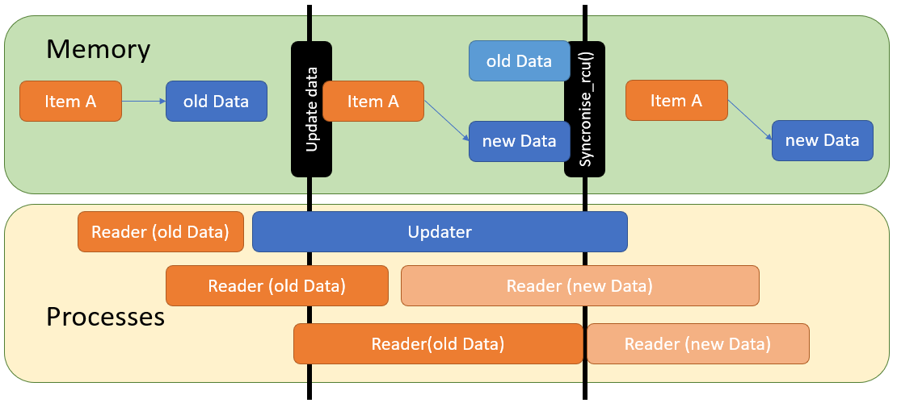
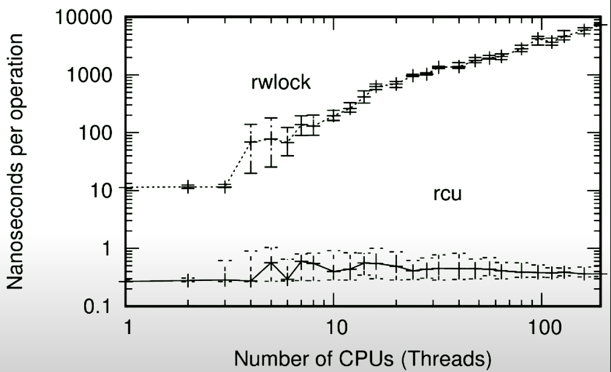
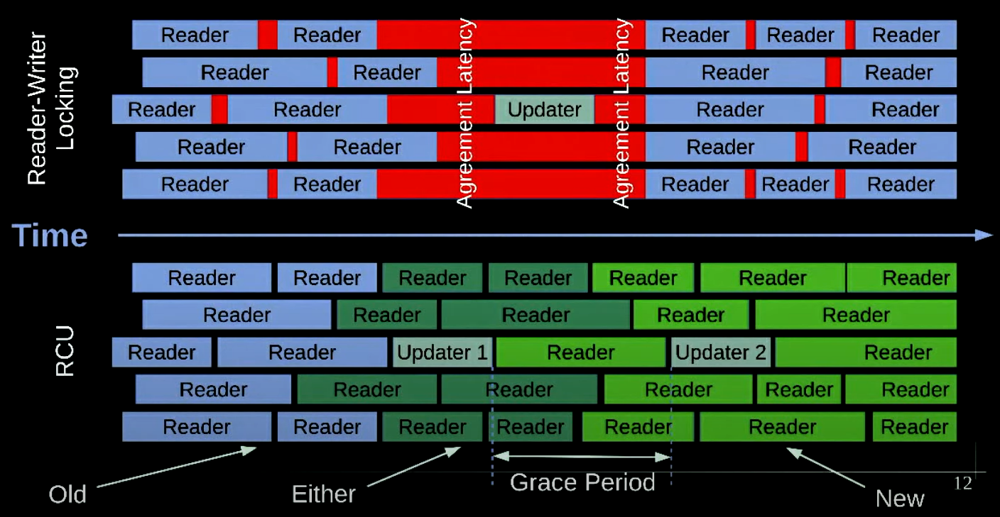

# Basic concept of RCU: Read, Copy, Update

>[!NOTE]
> Author: Lin Poyi
> Date: 2023/11/29

## What is RCU
RCU is a lock-free synchronization mechanism in Linux kernel, and **we use it in gtp5g**. RCU is a way of making changes to data structures that are mostly read by many threads but rarely updated by a few threads. RCU stands for “Read, Copy, Update”, which means that the updater thread first makes a copy of the data item, modifies the copy, and then replaces the original with the copy. It works very well and has great scalability under read-heavy use cases. Compared with Reader-Writer lock (RWlock) and other lock-based approaches, RCU is a lot faster but does not provide strong consistency over data.

In RCU, there's nothing blocking readers from entering the critical section. The reader can access the protected data at all times. Also, the updater can modify the data whenever it wants (assume only 1 updater) no matter if there are still readers using the data.

## Drawbacks of Reader-Writer lock (RWlock)
1. It is expensive and complex to implement, especially for fine-grained locking of individual data items.
2. It can cause contention and scalability issues, especially when the number of readers is large or the lock is held for a long time.
3. It can introduce deadlocks and livelocks, especially when the locking order is not well-defined or the lock is nested or reentrant.

## benefits of RCU
1. It is faster and more scalable for read-intensive workloads because the readers do not need to wait for the updaters or contend for shared resources.
2. It is simpler and more reliable for avoiding deadlocks because the readers do not need to acquire any locks or follow any ordering rules.
3. It is more flexible and adaptable for different scenarios because there are many variants of RCU that can handle different types of updates and readers.

## How to use RCU
While using RCU, there are some rules to be followed:
1. You need to mark the sections of code where you access the RCU-protected data structures as “RCU read-side critical sections”, using the appropriate RCU primitives, such as **rcu_read_lock()** and **rcu_read_unlock()**.
2. You need to mark the sections of code where you modify the RCU-protected data structures as “RCU update-side critical sections”, using the appropriate RCU primitives, such as **call_rcu()** and **synchronize_rcu()**.
3. You need to ensure that the RCU read-side critical sections are short and do not block, switch to user mode, or enter the idle loop unless you use a special variant of RCU that allows blocking, such as SRCU or preemptible RCU.
4. You need to ensure that the RCU update-side critical sections wait for a “grace period” to elapse before freeing or reusing the old versions of the data items and that the grace period is long enough that all the readers have finished accessing the old versions.
>[!NOTE]
>**Grace period** is the time between the data being changed by the updater and the time when all readers are using the new data. During the grace period, some readers may be using the old data, some may be using the new data.
### main RCU APIs
1. **rcu_read_lock()**: Inform others the reader is entering the critical section, does not actually block anyone from entering the critical section.
2. **rcu_read_unlock()**: Inform others the reader has exit critical section.
3. **rcu_assign_pointer()**: Using this API instead of directly assign pointer with "**=**" can avoid pointer been assigned before the update_data() been done due to CPU's out-of-order execution.
4. **syncronize_rcu()**: Wait for readers who are already in the critical section and haven't left yet. Used after updating the data and before the old data has been released.
5. **call_rcu()**: this function is the asyncronized version of **syncronize_rcu()**, it will return right after it scedules a handler (clean up the old data) to be performed after all previous readers left C.S.(critical section) **We use this instead of the syncronized version in gtp5g.**
### pseudo code for reader and updater
```
void Reader(){
    rcu_read_lock();    //enter C.S. (critical section)
    item *data = Item_A;
    access_data(data);
    rcu_read_unlock();  //leave C.S.
    return;
}
```
```
void Updater(){
    item *old_data = Item_A;  //save the old location
    item *new_data = new(item);    //make a new item
    update_data(new_data);   //modify the data in new item
    rcu_assign_pointer(Item_A, new_data);   //now the global pointer points to the new item
    syncronize_rcu();   //wait for all readers using old_data to leave C.S.
    kfree(old_data);  //now we can safely release the old_data
    return;
}
```


### another version of Updater with **call_rcu()**
```
void item_free(item *data){
    kfree(data);
    return;
}
void Updater(){
    item *old_data = Item_A;  //save the old location
    item *new_data = new(item);    //make a new item
    update_data(new_data);   //modify the data in new item
    rcu_assign_pointer(Item_A, new_data);   //now the global pointer points to the new item
    call_rcu(old_data, item_free);   //schedule item_free(old_data) to be performed after all previous readers left C.S. and return immediately
    return;
}
```


When the updater tries to update the data, the data doesn't get replaced instantly. The pointer will point to new data, but the old data still exists in the memory. This method prevents readers who are still accessing the old data from accessing the released memory and also allows updates before all readers leave the critical section.

## Comparison between RCU and RWlock
> **scalability of RWlock and RCU**


The graph above shows that RCU not only has **better scalability** with CPUs but also has **better overall performance**, which is not surprising when we look at the CPU utilization difference between RWlock and RCU in the graph shown below. But keep in mind that RCU does not guarantee that all readers running simultaneously have the same version of data, but RWlock does. Also if there's **more than one updater**, you might need some locks to prevent multiple updates been performed at the same time.
> **What it might look like in the CPUs while running these two methods**


## Reference
[https://www.kernel.org/doc/html/next/RCU/whatisRCU.html](https://www.kernel.org/doc/html/next/RCU/whatisRCU.html)

[https://hackmd.io/@cccccs100203/So-What-Has-RCU-Done-Lately](https://hackmd.io/@cccccs100203/So-What-Has-RCU-Done-Lately)

[Linux kernel design: RCU synchronization mechanism](https://beta.hackfoldr.org/linux/https%253A%252F%252Fhackmd.io%252Fs%252FH19V4eyfV)

[So What Has RCU Done Lately?](https://www.youtube.com/watch?v=9rNVyyPjoC4)

