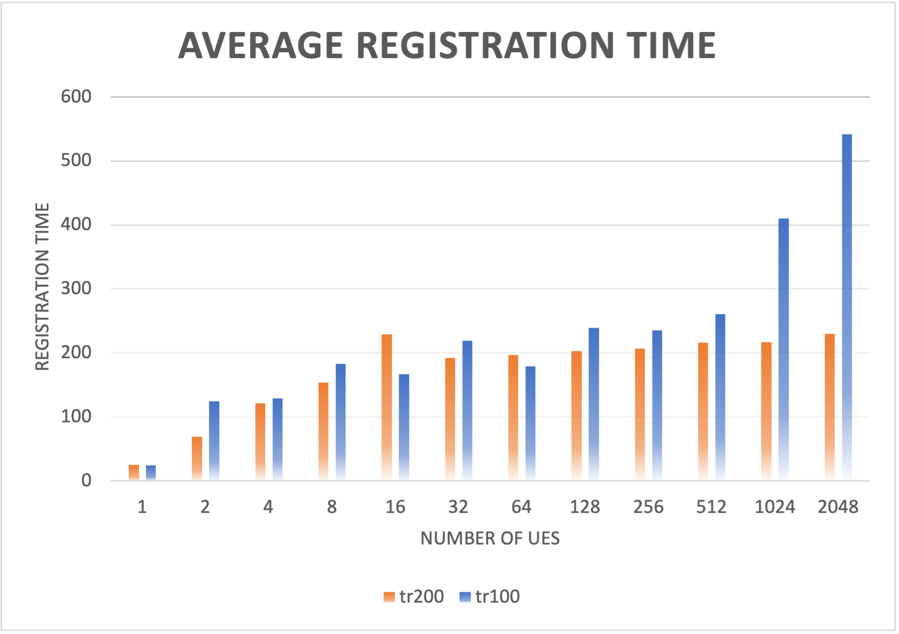

# PacketRusher: A new UE/gNB simulator and CP/UP load tester

>[!NOTE]
>Author: Michael Chien (newb1er)
>Date: 2024/1/10

## Introduction

[PacketRusher](https://github.com/HewlettPackard/PacketRusher) is an innovative open-source project developed by Hewlett Packard, drawing inspiration from [my5G-RANTester](https://github.com/my5G/my5G-RANTester) and leveraging multiple libraries created by [free5GC](https://free5gc.org/). Its primary objective is to establish automated and high-performance UE/RAN testing suites.

In this blog, we will guide you through the setup process and some experiment results.

## Quick Start

### Overview


We are going to create two VMs here. We run free5GC core on one machine and run PacketRusher on the other.

Here is the VM spec,

- Platform: VirtualBox
- OS: Ubuntu 20.04
- CPUs: 2
- RAM: 2048

and the host spec,

- OS: Ubuntu 22.04
- CPU: Intel Core i5-12400
- RAM: 32GB

### free5GC setup

You can follow [the tutorials](https://free5gc.org/guide/#free5gc-installation-guide) to install free5GC. Here, we will create a VM and run CP and UP on the same VM.

### PacketRusher Setup

They provides a very thorough [installation guide on their wiki](https://github.com/HewlettPackard/PacketRusher/wiki/Installation). Please follow the official instructions in case of any updates.

We will lead you through installation that helps you get hand-on experice more quickly. First, create a new VM that runs Ubuntu 20.04. Then, follow the instruction below to install all the dependencies.

```sh
sudo apt install build-essential linux-headers-generic make git wget tar linux-modules-extra-$(uname -r)

sudo rm -rf /usr/local/go
# PacketRusher requires Go 1.20 or newer version, 
# we choose 1.21.3 as it's the latest patch version at the moment.
# Kindly refer to the official Golang changelog should you 
# seek additional information on new features or bug fixes.
wget https://go.dev/dl/go1.21.3.linux-amd64.tar.gz -O - | sudo tar -C /usr/local -zxvf -
echo "export PATH=$PATH:/usr/local/go/bin" >> $HOME/.profile
source $HOME/.profile
```

After that, we can now clone the repo and build the PacketRusher.

```sh
git clone https://github.com/HewlettPackard/PacketRusher
cd PacketRusher
PACKETRUSHER=$PWD

# Install gtp5g kernel module
cd $PACKETRUSHER/lib/gtp5g && make clean && make && sudo make install

# build PacketRusher binary
cd $PACKETRUSHER && go mod download && go build cmd/packetrusher.go
```

### PacketRusher gNB/UE config

All the configuration about gNodeB and UE is located in `$PACKETRUSHER/config/config.yml` file.

Here is the example,

```yaml
gnodeb:
  controlif:
    ip: "192.168.56.11"
    port: 9487
  dataif:
    ip: "192.168.56.11"
    port: 2152
  plmnlist:
    mcc: "208"
    mnc: "93"
    tac: "000001"
    gnbid: "000008"
  slicesupportlist:
    sst: "01"
    sd: "010203" # optional, can be removed if not used

ue:
  msin: "0000000003"
  key: "8baf473f2f8fd09487cccbd7097c6862"
  opc: "8e27b6af0e692e750f32667a3b14605d"
  amf: "8000"
  sqn: "000000000023"
  dnn: "internet"
  routingindicator: "0000"
  hplmn:
    mcc: "208"
    mnc: "93"
  snssai:
    sst: 01
    sd: "010203" # optional, can be removed if not used
  integrity:
    nia0: false
    nia1: false
    nia2: true
    nia3: false
  ciphering:
    nea0: true
    nea1: false
    nea2: true
    nea3: false
amfif:
  ip: "192.168.56.10"
  port: 38412
logs:
    level: 4
```

Feel free to customize the configuration to suit your preferences. Make sure it corresponds to your 5GC config.

### Register a set of gNB and UE

Now, we are ready to rock! Go ahead and runs this command,

```sh
# Make sure to run PacketRusher as root
# because it will create a gtp5g tunnel.
sudo ./packetrusher ue
```

Now a new GTP tunnel is created and a new PDU session has established.
Open another shell and ping google DNS.

```sh
# You can find VRF name on the output of `./packetrusher ue`
sudo ip vrf exec <vrf_name> ping 8.8.8.8
```

## Experiment

### Multi-UE Registration Load Test



### Bandwidth Test

We use iperf3 to perform this test.

iperf3 server runs on the VM-5GC.

iperf3 client send traffic through the GTP tunnel we just created on VM-RAN/UE.

The GTP-U tunnel traffic is forwarded by VirtualBox host-only NICs.

```plain
# `iperf3 -c 192.168.56.10`

[ ID]   Interval        Transfer     Bitrate         Retr
[  6]   0.00-10.00 sec  2.17 GBytes  1.86 Gbits/sec  679             sender
[  6]   0.00-10.00 sec  2.17 GBytes  1.86 Gbits/sec                  receive
```

## About

Hey there, I'm Michael! I hopped on board with the free5GC team last summer, diving into the exciting world of 5G. This is my first shot of sharing my experiences, and I'm stoked about it. Any advise or discussion are welcome!

<p align="left" style="display: flex; gap: 0.5rem;">
<a href="https://www.linkedin.com/in/michael-chien-newb1er/" target="blank">
 
</a>
<a href="https://github.com/newb1er" target="blank">
   
</a>
</p>