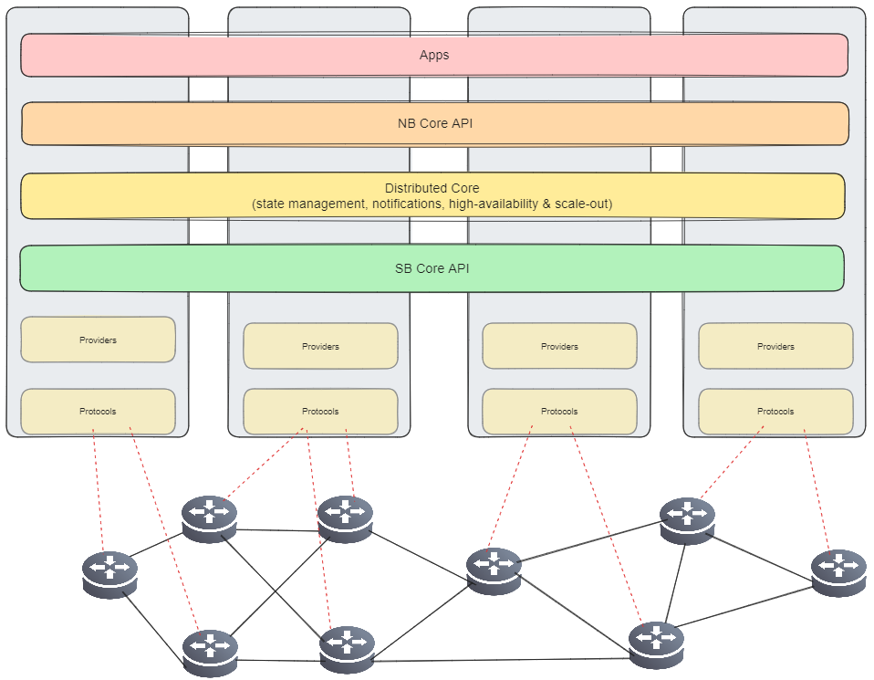
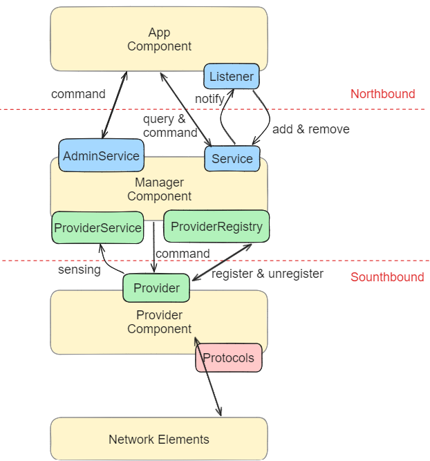

# Introduction to ONOS

>[!NOTE]
> Author: HanHung Chen
> Date: 2024/05/21
---

The way we manage networks is undergoing a revolution. Traditional, hardware-centric approaches are giving way to a software-defined future.

## Traditional Network vs. Software Defined Networking(SDN)
### Traditional Network 

- Traditional networks typically have an integrated control and data plane and use distributed control.
  - The control plane is responsible for routing and forwarding traffic.
  - The data plane is responsible for transmitting traffic. 
- The advantage
  - Well-established and widely used: Traditional networks have been around for a long time. This means there's a vast pool of knowledge and expertise available for managing and troubleshooting them. Organizations likely already have the necessary tools and personnel in place.
  - Predictable performance: Traditional networks are designed with dedicated hardware and software for specific purposes. This allows for consistent and predictable performance because the behavior of the network is well-understood.
- The disadvantage
  - Less flexible: Traditional networks have a rigid, hierarchical architecture that is difficult to modify or adapt to changing business needs.
  - Limited automation: Because traditional network is highly depending on hardware, it requires manual intervaention.
  - Limited scalability: Traditional networks have limited scalability due to the dependence on physical hardware devices.

### SDN

- Software-defined networking (SDN) is a new network architecture that separates the control plane from the data plane. 
- SDN Architecture typically consist of the following components:
  - Controller: The controller is responsible for controlling the routing and forwarding of traffic across the entire network.
  - Switches: Switches are responsible for transmitting traffic.
  - Southbound API: The southbound API is the interface that the controller uses to control switches.
  - Northbound API: The northbound API is the interface that applications use to interact with the controller.
- The advantage
  - Centralized provisioning: SDN virtualizes both the data and control planes allowing the user much easier to provision physical and virtual elements. This is useful as traditional infrastructure can be challenging to monitor especially if there are many disparate systems that need to be managed individually.
  - Good scalability: A good side effect of centralized provisioning is that SDN gives the user more scalability. By having the ability to provision resources at will you can change your network infrastructure at a moment’s notice.
- The disadvantage
  - High latency: SDN has high latency, due to both software implementation inefficiencies and interactions between switch hardware properties and the control operation workload.
  
## Open Network Operating System (ONOS)

### What is ONOS ?

- Open Network Operating System (ONOS) is an open source network operating system (OS) from the Open Networking Lab (ON.Lab), which released the ONOS source code, written in Java, to the open source community in December 2014. The goal of the project is to create a software-defined networking (SDN) operating system for communications service providers that is designed for scalability, high performance and high availability.

- ONOS platform includes:
  - A platform and a set of applications that act as an extensible, modular, distributed SDN controller.
  - Manages entire network (rather than a single device)
  - Simplified management, configuration and deployment of software, hardware and services.
  - A scale-out architecture to provide resiliency and scalability
  - Required to meet the rigors of production carrier environments.

### ONOS feature

- Performance at Scale
  - ONOS has been architected and built to provide the highest performance possible for scaled network operations. ONOS scales as needed by adding new instances when more control plane capacity is needed.
capacity is needed.
- Modular Software
  - Software is easier to read, test, and maintain. Most importantly, it allows more easily to customize the software.
- Northbound Abstractions
  - ONOS provides northbound abstractions that simplify the creation, deployment, and operation of configuration, management and control applications.
- Southbound Abstractions
  - ONOS abstracts device characteristics so that the core operating system does not have to be aware of the particular protocol being used to control or configure a device.

### ONOS Distributed Architecture

#### Distributed Core

- This part is protocol-Agnostic
- Interact with Network-facing modules via a southbound (provider) API
- Interact with Applications via the northbound (consumer) API

#### Applications(Apps)

- Applications take and react base on the information provided by the core.

#### Providers & Protocols

- These two parts are protocol-aware network-facing modules.
- Acquire network state information through protocol-specific means.
- Interact with the core via a southbound (provider) API.

### Subsystems of the Core

- The ONOS core comprises several subsystems, each responsible for a particular aspect of network state (e.g. topology, host tracking, packet intercept, flow programming). Each subsystem maintains its  service abstraction, where its implementation is responsible for propagating the state throughout the cluster.
- Example subsystems
  - Device Subsystem: Manages inventory of infrastructure devices. (Device and Port)
  - Link Subsystem: Manages inventory of infrastructure links.
  - Host Subsystem: Manages inventory of end-station hosts and their locations.
  - Topology Subsystem: Manages time-ordered snapshots of network graph views.
  - PathService: Computes/finds paths between infrastructure devices or between end-station hosts (using the most recent topology graph snapshot).
  - FlowRule Subsystem: Manages inventory of match/action flow rules installed on  infrastructure devices and provides flow metrics.
  - Packet Subsystem: Allows applications to listen for   data packets received from network devices and to emit data packets out onto the  network via one or more network devices.
  - Driver Subsystem: Isolate device-specific code from rest of the system

### Subsystem Structure

#### Manager

- The Manager is located in the core
  - Gathers data from Providers
  - Delivers information to applications and other services.
- **NB Service Interface**: allows applications or other core components to access specific network state information.
- **NB AdminService Interface**: used for receiving administrative commands and implementing them in the network state or system.
- **SB ProviderRegistry Interface**: enables Providers to register with the Manager, allowing interaction between Providers and the Manager.
- **SB ProviderService Interface**: available to registered Providers, allowing them to exchange information with the Manager.

#### Providers

- Providers are protocol-aware and register with the core to be recognized.
  - **ProviderRegistry Interface**: Providers register their presence with the core.
  - **Provider Interface**: Providers receive control commands from the core.
  - **using protocol-specific methods**: Providers interact with network elements.
  - **ProviderService Interface**: Providers deliver service-specific sensory data to the core.

#### Application

- Users of the Manager's service interface
- Can obtain information in both synchronous and asynchronous manners
  - **Synchronous**: by making queries to the service
  - **Asynchronous**: by acting as an event listener
    - By implementing an EventListener interface to handle events
    - Register events through the ListenerService interface
    - The ListenerService interface is integrated into each Service interface

## Conclusion
Combining SDN with ONOS and free5GC enables a powerful platform for experimenting with next-generation network technologies, offering enhanced flexibility and control over network management and 5G services.

## Reference
- [ONOS - Wikipedia](https://en.wikipedia.org/wiki/ONOS)
- [ONOS Official Website](https://opennetworking.org/onos/)
- [ONOS Wiki](https://wiki.onosproject.org/display/ONOS/ONOS)
- [Difference between Software Defined Network and Traditional Network
](https://www.geeksforgeeks.org/difference-between-software-defined-network-and-traditional-network/)

## About me

Hi, I am Han-Hung Chen, a beginner to 5G and free5gc. Let me know without hesitation if there is any mistake in the article.

### Connect with Me

- GitHub: [https://github.com/HanHongChen](https://github.com/HanHongChen)