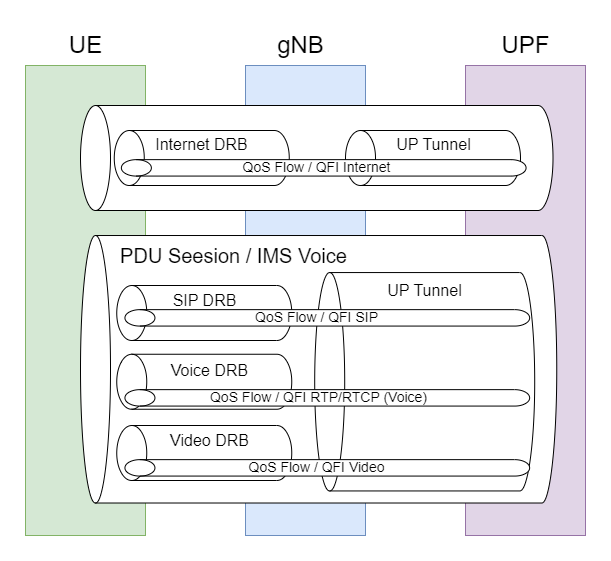
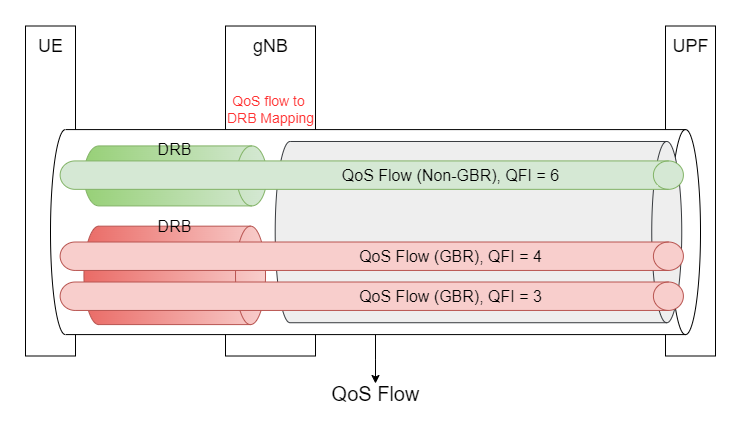
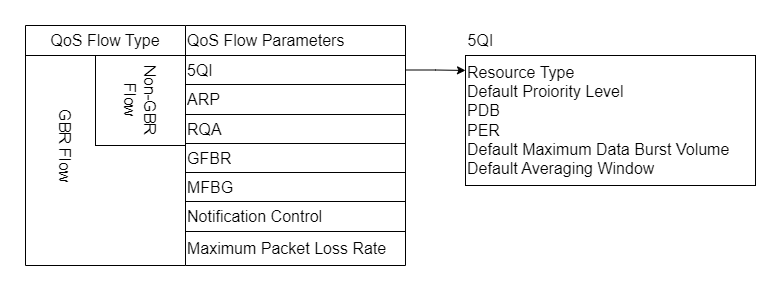

# Introduction to 5G Quality of Service (QoS)

>[!NOTE]
> Author: Ting-Yuan Chou
> Date: 2024/06/28
---

## Introduction
5G networks revolutionize connectivity with their ability to support high-speed data, low latency, and massive device connectivity. A key element in this innovation is Quality of Service (QoS), which ensures that diverse network demands are met with precision, whether for broadband, critical communications, or IoT. Understanding QoS is crucial for leveraging 5G’s full potential in catering to varied digital needs.

## 5G QoS Architecture

This diagram illustrates the relationship between PDU sessions and QoS flows within a 5G network, involving the User Equipment (UE), gNodeB (gNB), and User Plane Function (UPF). Each PDU session can encompass multiple QoS flows, each tailored to a specific type of service, ensuring that different data streams receive appropriate quality of service levels based on their requirements.

### Key Components
- **PDU Session** - This is a logical connection between the UE and the data network, which can carry one or more QoS flows.
- **QoS Flow** - A QoS flow is a logical channel with specific QoS characteristics that guarantee certain service levels for the data transported within it.
- **Data Radio Bearer (DRB)** - This is used to transport the QoS flows between the UE and gNB.
- **UP Tunnel** - It represents the path that QoS flows take between the gNB and the UPF.

### Explained with the Diagram
- **Internet PDU Session** - Includes an Internet DRB and associated QoS flow marked with QFI (QoS Flow Identifier) for internet services.
- **IMS Voice PDU Session** - Contains multiple DRBs for SIP, RCS, Voice, and Video services, each with its own QoS flow and QFI, such as QFI SIP for SIP services, and QFI RTP/RTCP for voice.

## QoS Flow Overview
In 5G networks, QoS Flows are crucial for ensuring the quality of data transmission. According to 3GPP standards, QoS Flows are categorized into two types:

### Types of QoS Flow
- **GBR QoS Flows** - Require a guaranteed flow bit rate.
- **Non-GBR QoS Flows** - Do not require a guaranteed flow bit rate.

### QFI (QoS Flow Identifier)
Each QoS Flow is identified by a unique QoS Flow ID (QFI), which is unique within the scope of a PDU session and visible in the GTP-U header of 5G user-plane packets. The lifecycle of a QoS Flow is managed by the SMF, including its establishment, modification, and deletion. SMF creates a default QoS Flow for each PDU session, associated with a default QoS Rule installed in the UE for mapping uplink packets.

### QoS Flow Management
The management of QoS Flows is controlled by the SMF, including the creation, modification, and deletion of QoS Flows. Whenever any PDU session is established, the SMF creates a default Non-GBR QoS Flow associated with a default QoS Rule that allows all uplink packets to pass.

### Components of QoS Flow instantiation
- **QoS Profile** - Can be distributed by SMF to the gNB or predefined on the gNB. Each QoS Profile contains a series of QoS parameters corresponding to a QFI.
- **QoS Rule** - Sent to the UE via NAS message by SMF, including a series of QoS parameters and Packet Filters.
- **PDR(s)** - Sent to the UPF via PFCP messages by SMF, containing rules and parameters related to QoS.

## Default QoS Flow vs GBR QoS Flow

The diagram illustrates the architecture of QoS Flows in a 5G network, highlighting the two main types: Default QoS Flow and GBR QoS Flow.

- **Default QoS Flow (Non-Guaranteed Bit Rate, Non-GBR)** 
  - As shown by the green tunnel in the diagram, each PDU Session has a default QoS Flow, with a QFI of 102, classified as Non-GBR. This indicates that the flow does not guarantee a fixed data transfer rate. The default QoS Flow typically has the lowest priority, and all uplink or downlink data flows use this default QoS Flow when no higher priority service data flows (SDF) are matched.

- **GBR QoS Flow (Guaranteed Bit Rate)** 
  - The pink tunnel in the diagram exemplifies a GBR QoS Flow, with a QFI of 101. This type of flow guarantees a fixed data transfer rate, suitable for applications requiring high quality of service assurance, such as voice and video calls. This GBR QoS Flow contains two SDFs, indicating that two business data flows meet this QoS Flow, enjoying the same QoS forwarding treatment.

## QoS Profile

### Parameters for Every QoS Flow
- **5G QoS Identifier (5QI)** - Defines the type of QoS Flow (GBR, Non-GBR, or Delay Critical GBR).
- **Allocation and Retention Priority (ARP)** - Priority for resource allocation and retention.

### Parameters for Non-GBR QoS Flow
- **Reflective QoS Attribute (RQA)** - Reflective QoS attribute used for dynamic adjustment of QoS settings.

### Parameters for GBR QoS Flow
- **Guaranteed Flow Bit Rate (GFBR)** - Guaranteed bitrate applicable to uplink and downlink.
- **Maximum Flow Bit Rate (MFBR)** - Maximum bitrate applicable to uplink and downlink.

### Additional important parameters for GBR QoS Flow
- **Notification Control** - Controls the notifications.
- **Maximum Packet Loss Rate** - Maximum allowable packet loss rate for uplink and downlink.

### 5QI
In 5G networks, the 5G QoS Identifier (5QI) defines the specific Quality of Service characteristics for a QoS Flow. Below is a detailed description of the key QoS characteristics associated with different types of 5QI.

| QoS Characteristic                   | Description                                                                                                                           |
| ------------------------------------ | ------------------------------------------------------------------------------------------------------------------------------------- |
| **Resource Type**                    | Specifies whether the QoS Flow is GBR, Delay Critical GBR, or Non-GBR.                                                                |
| **Priority Level**                   | Indicates the priority level of the QoS Flow, which impacts the allocation and retention of resources.                                |
| **Packet Delay Budget (PDB)**        | The maximum allowable delay for packets within the QoS Flow, crucial for maintaining the latency requirements.                        |
| **Packet Error Rate (PER)**          | Defines the acceptable error rate for packets within the QoS Flow, ensuring data integrity.                                           |
| **Averaging Window**                 | Applies only to GBR and Delay-critical GBR resources, determining the time period over which the guaranteed bit rates are calculated. |
| **Maximum Data Burst Volume (MDBV)** | Relevant only for Delay-critical GBR resources, specifies the maximum amount of data transmitted in a burst.                          |

## QoS Rule
In 5G networks, QoS Rules are crucial configurations that guide how user-plane data flows are handled. QoS Rules determine which packets should be allocated to specific QoS flows to ensure the quality of data transmission.

- **Definition of QoS Rules**
   - A QoS Rule includes the associated QoS flow's QFI (QoS Flow Identifier), a set of packet filters, and a priority. Packet filters determine which packets should be forwarded to a specific QoS flow.

- **Configuration of QoS Rules**
   - QoS Rules can be explicitly provided to the UE during PDU session establishment or modification through signaling. They can also be pre-configured on the UE or implicitly derived through the UE's use of reflective QoS mechanisms.

- **Default QoS Rules**
   - Each PDU session is configured with a default QoS rule, which is associated with a QoS flow. For IP or Ethernet type PDU sessions, the default QoS rule is the only packet filter set, typically configured to allow all uplink packets.

- **Application of Packet Filters**
   - If the UE does not find a matching QoS rule, it will discard the uplink packet. This ensures that only data meeting specific QoS criteria are sent.

## QoS Flow Mapping
QoS mapping is crucial in 5G networks, ensuring that data packets are correctly mapped to corresponding QoS flows and network resources. Here is an introduction to the process and implementation of QoS mapping:

1. **Process of QoS Mapping**
   - **Role of SMF**: The SMF binds SDFs to specific QoS flows based on QoS and service requirements, assigning a QFI and exporting related QoS configuration profiles for each new QoS flow.
   - **Data Flow and QoS Flows**: As shown in the diagram, UL (uplink) and DL (downlink) data packets are processed through appropriate QoS rules and mapped to corresponding QoS flows.

2. **Mapping of QoS Rules to QoS Flows**
   - **SMF to (R)AN**: SMF indirectly influences resource allocation in the RAN through the coordination with the AMF, which relays necessary QoS information, including QFIs and QoS profiles, to ensure proper resource management.
   - **SMF to UPF**: SMF instructs the UPF on packet classification, bandwidth execution, and marking, including setting up DL PDR / UL PDR and providing QoS related information (such as MBR, GFBR, and MFBR).

3. **Packet Handling**
   - **Downlink Data Handling**: The UPF classifies packets based on PDRs, ensuring that packets are appropriately downlinked according to their QoS needs.
   - **Uplink Data Handling**: The UE classifies and marks uplink packets according to QoS rules and uploads them through the designated QoS flows.

4. **Exception Handling**
   - If a packet does not match a DL PDR or a QoS rule (for uplink), it will be discarded by the UPF or UE.

## How NFs Achieve the QoS in the 5G System

### NFs involved in QoS
- **AMF (Access and Mobility Management Function)** - Located within the Control Plane, the AMF handles all control functions related to access and mobility. This includes managing UE registration and area tracking based on QoS requirements.
- **SMF (Session Management Function)** - A core component in the Control Plane, the SMF is responsible for session management, including the negotiation and assurance of QoS. The SMF configures user plane data flows and ensures these flows meet their required QoS.
- **PCF (Policy Control Function)** - The PCF provides policy rules in the Control Plane to regulate network behavior, including decisions and applications of QoS policies. It determines which QoS rules apply to specific data flows and conveys these rules to the SMF for enforcement.
- **UPF (User Plane Function)** - The primary component of the User Plane, the UPF handles data forwarding and processing. It enforces QoS rules received from the SMF to ensure the quality of service for different data streams. The UPF ensures that data is correctly tagged and handled within the network to meet its QoS requirements.

### Interaction
#### Downlink Direction (UPF to UE)
- The IP flows created by application layers and received from DN are mapped to SDFs (Service Data Flow) and then to QoS flows using PDRs (Packet Detection Rules).
- The QoS flows are then carried through N3 GPRS tunnels using GTPv1-U protocol.
- The QoS flows received from N3 tunnels are then mapped by the SDAP layer in the gNB to the DRBs using the QoS profiles prepared by the SMF as well as the parameters configured by the operator.

#### Uplink Direction (UE to UPF)
- To map IP flows received from the application layer to QoS flows, QoS rules are prepared by SMF. 
- To map the QoS flows to the DRBs, the 5G device is configured through RRC Reconfiguration or by using SDAP header in the case of Reflective QOS.

#### Core Network
- When UE send PDU establishment request to AMF, SMF will get Nsmf_PDUSession_CreateSMContext from AMF, then SMF need to: 
  - send Npcf_SMPolicyControl_Get to PCF
  - PCF respond with policy rules (PCC Rules) back to SMF via HTTP/2 protocol.
  - SMF Constructs NAS-5GSM Message Based on Policy Rules:
    - The SMF constructs a NAS-5GSM message to inform the UE about the specific QoS policies that it should apply for mapping uplink (UL) packets to QoS flows and for applying QoS flow marking.
  - SMF Sends QoS Profiles to the AMF via N1N2MessageTransfer Request Call Flow:
    - The SMF uses the N1N2MessageTransfer to send QoS profiles to the AMF. This transfer includes not only the delivery of QoS profiles to the gNB via NGAP messages but also the transmission of NAS messages to the UE. This step aids the gNB in mapping the QoS flows to the Data Radio Bearers (DRBs) and applies QoS rule to UE.
  - SMF Sends PFCP Message to Instruct the UPF to Apply PDR:
    - The SMF sends a PFCP (Packet Forwarding Control Protocol) message to the UPF to guide the UPF on applying the predefined PDRs (Packet Detection Rules).

## Conclusion
In conclusion, 5G Quality of Service (QoS) represents a cornerstone in the evolution of mobile networks, enabling a diverse array of applications to operate with the requisite service quality, ranging from high-speed data services to low-latency critical communications and massive IoT deployments. This article has explored the key functions and mechanisms through which 5G networks manage and enforce QoS, emphasizing the roles of various network functions such as the AMF, SMF, PCF, and UPF.

We delved into the intricacies of QoS flows, illustrating how different data streams are handled within the network to ensure that each meets its specific quality requirements. The discussion on QoS flow management, including the differentiation between GBR and Non-GBR flows, highlights the adaptability and precision of 5G QoS capabilities.

Furthermore, the process of QoS mapping and the roles of QoS rules in directing traffic within the network infrastructure were clarified. This ensures that data is not only efficiently managed but also adheres to the stringent quality standards required by modern applications.

Overall, the effective implementation of QoS in 5G networks is fundamental to maximizing network resource utilization and enhancing user experience, establishing a robust framework for the future of telecommunications.

## Reference
- [TS 23.501](https://www.etsi.org/deliver/etsi_ts/123500_123599/123501/17.05.00_60/ts_123501v170500p.pdf)
- [TS 23.502](https://www.etsi.org/deliver/etsi_ts/123500_123599/123502/16.05.00_60/ts_123502v160500p.pdf)
- [TS 23.502](https://www.etsi.org/deliver/etsi_ts/123500_123599/123503/17.05.00_60/ts_123503v170500p.pdf)
- [TS 24.501](https://www.etsi.org/deliver/etsi_ts/124500_124599/124501/17.07.01_60/ts_124501v170701p.pdf)

## About me

Hi, I am Ting-Yuan Chou, a beginner to 5G and free5gc. Let me know without hesitation if there is any mistake in the article.

### Connect with Me

- GitHub: [https://github.com/TYuan0816](https://github.com/TYuan0816)