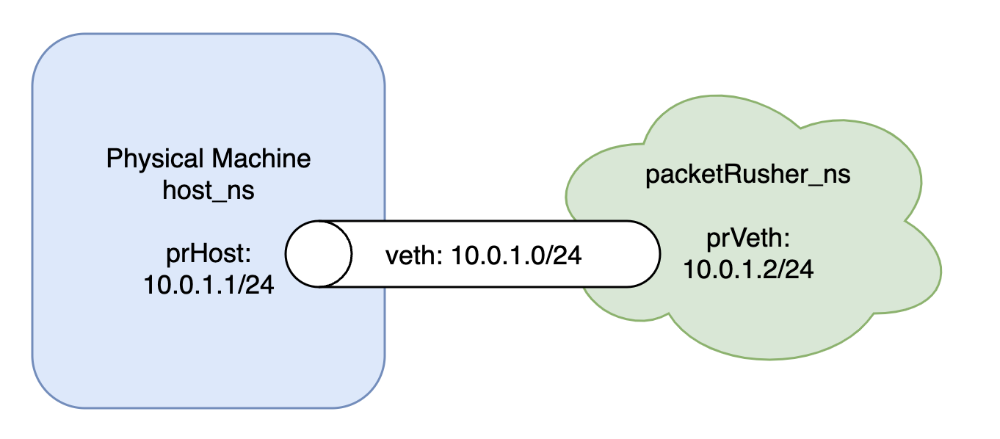
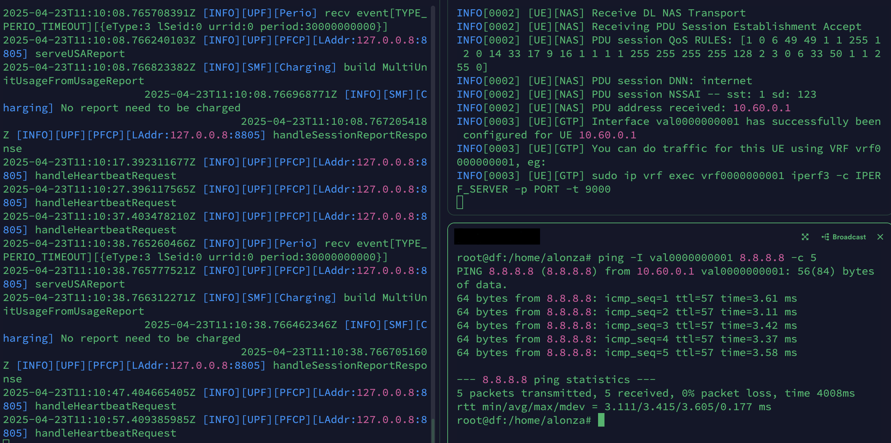

# Namespace-Based GTP5G Conflict Resolution for free5GC and PacketRusher

> [!Note]
> Author: [Alonza Tu](https://www.linkedin.com/in/feng-tu-b91405345/)
> Date: 2025/04/30

---

## GTP5G Conflict Description

When deploying [free5GC](https://github.com/free5gc/free5gc) and [PacketRusher](https://github.com/HewlettPackard/PacketRusher)(RAN/UE) on the same physical machine, one common challenge is the conflict over the GTP5G network device. Both components attempt to bind and operate on the same virtual interface, which leads to PDU session establishment failure.

To address this issue elegantly, we can leverage Linux network namespaces to isolate PacketRusher's network environment. In this blog post, we will walk through the process of setting up PacketRusher in a dedicated namespace, ensuring seamless coexistence with the free5GC core network on a single host.

## Advantages with Network Namespace

As we know, free5GC provides a [Docker Compose](https://github.com/free5gc/free5gc-compose) setup on GitHub, which allows deploying the core network along with RAN/UE components on the same machine. However, if we only want to test specific features or run components in debug mode, running the core network and RAN/UE directly on the host can be more convenient and flexible for development purposes.

## Network Namespace Introduction

Network namespaces are a fundamental feature of the Linux kernel that provides isolation of network resources. Each namespace has its own network interfaces, routing tables, firewall rules, and network devices. This isolation ensures that processes in different namespaces cannot interfere with each other's network configurations, making it an ideal solution for our GTP5G conflict scenario.

For a deeper understanding of Linux network devices and their management, you can refer to our previous blog post on [Network Devices in Linux](https://free5gc.org/blog/20250123/20250123/).

## Network Namespace Deployment

### Architecture Overview



There will be an additional network namespace called `packetRusher_ns`, connected to the host network namespace via a veth pair( `prHost` < - >  `prVeth`).

### Setup Step by Step

1. Linux Network Namespace
    a. Create the target network namespace
        Here we create a network namespace called `packetRusher_ns`.
        ```bash
        sudo ip netns add packetRusher_ns 2>/dev/null || true
        ```
    b. Create the veth pair
        Here we create a veth pair with one side is `prHost` and the other side is `prVeth`.
        ```bash
        sudo ip link add prHost type veth peer prVeth
        ```
    c. Move veth peer to namespace
        Now, we need to move `prVeth` into `packetRusher_ns`.
        ```bash
        sudo ip link set prVeth netns packetRusher_ns
        ```
    d. Bring up the interfaces
        After setting the veth pair, we need to bring them up in both host network namespace and `packetRusher_ns`.
        ```bash
        sudo ip link set prHost up
        sudo ip netns exec packetRusher_ns ip link set prVeth up
        ```
    e. Configure IP addresses
        Now we need to configure the specific IPs for both `prHost` and `prVeth`.
        The IP class is `10.0.1.0/24` in this example.
        ```bash
        sudo ip addr add 10.0.1.1/24 dev prHost
        sudo ip netns exec packetRusher_ns ip addr add 10.0.1.2/24 dev prVeth
        ```
    f. Configure routing in `packetRusher_ns`
        We have to make `packetRusher_ns` know where to route the traffic.
        ```bash
        sudo ip netns exec packetRusher_ns ip route add default via 10.0.1.1
        ```
2. free5GC Core Network
   For core network configuration and local running, please refer to: [Build and Install free5GC](https://free5gc.org/guide/3-install-free5gc/)
   Make sure to modify AMF/SMF/UPF's configuration YAML file:

    - ~/free5gc/config/amfcfg.yaml

        Replace ngapIpList IP from 127.0.0.1 to your host ip, not `prHost`, namely from:

        ```yaml
        ngapIpList:  # the IP list of N2 interfaces on this AMF
        - 127.0.0.1
        ```

        into

        ```yaml
        ngapIpList:  # the IP list of N2 interfaces on this AMF
        - <your host ip, not prHost>
        ```

    - ~/free5gc/config/smfcfg.yaml

        In the entry inside `userplaneInformation / upNodes / UPF / interfaces / endpoints`, change the IP from 127.0.0.8 to your host ip, not `prHost`, namely from:

        ```yaml
        interfaces: # Interface list for this UPF
        - interfaceType: N3 # the type of the interface (N3 or N9)
            endpoints: # the IP address of this N3/N9 interface on this UPF
            - 127.0.0.8
        ```

        into

        ```yaml
        interfaces: # Interface list for this UPF
        - interfaceType: N3 # the type of the interface (N3 or N9)
            endpoints: # the IP address of this N3/N9 interface on this UPF
            - <your host ip, not prHost>
        ```

    - ~/free5gc/config/upfcfg.yaml

        Change GTPU IP from 127.0.0.8 into your host ip, not `prHost`, namely from:

        ```yaml
        gtpu:
            forwarder: gtp5g
            # The IP list of the N3/N9 interfaces on this UPF
            # If there are multiple connection, set addr to 0.0.0.0 or list all the addresses
            ifList:
            - addr: 127.0.0.8
              type: N3
        ```

        into

        ```yaml
        gtpu:
            forwarder: gtp5g
            # The IP list of the N3/N9 interfaces on this UPF
            # If there are multiple connection, set addr to 0.0.0.0 or list all the addresses
            ifList:
            - addr: <your host ip, not prHost>
              type: N3
        ```

3. PackerRusher
   For PacketRusher setup, build, and local running, please refer to: [PacketRusher: A new UE/gNB simulator and CP/UP load tester](https://free5gc.org/blog/20240110/20240110/)
   Now, we're going to modify the configuration to make PacketRusher run in `packetRusher_ns`:

    - Modify IP field in `controlif` and `dataif` into the `prVeth`'s IP, like:

        ```yaml
        gnodeb:
            controlif:
                ip: "10.0.1.2" # prVeth's IP
                port: 9487
            dataif:
                ip: "10.0.1.2" # prVeth's IP
                port: 2152
        ```

    - Also set the AMF's IP as your core network's AMF's IP(the `ngapIpList` we set in the previous part):

        ```yaml
        amfif:
            - ip: <your host ip, not prHost>
        ```

4. Running
    a. Start the core network in terminal-1:
        ```bash
        ./run.sh
        ```
    b. Create a new subscriber via web console:
        For creating subscriber, please refer to: [Create Subscriber via Webconsole](https://free5gc.org/guide/Webconsole/Create-Subscriber-via-webconsole/)

    c. Get into the `packetRusher_ns` in terminal-2 and terminal-3:
        ```bash
        sudo ip netns exec packetRusher_ns bash
        ```
    d. Start up the PacketRusher in terminal-2:
        ```
        ./PacketRusher/packetrusher ue
        ```
    e. Data plane test in terminal-3:
        ```bash
        ping -I val0000000001 8.8.8.8
        ```
    f. Exit `packetRusher_ns`
        ```bash
        exit
        ```

5. Demo Result:

    

    - Left part is core network.
    - Right part is PacketRusher and the `ping` test.

6. Clean the `packerRusher_ns`
    a. Bring down interface
        ```bash
        sudo ip link set prHost down 2>/dev/null || true
        ```
    b. Delete veth pair
        ```bash
        sudo ip link delete prHost 2>/dev/null || true
        ```
    c. Delete network namespace
        ```bash
        sudo ip netns delete packetRusher_ns 2>/dev/null || true
        ```

## Conclusion

In this blog post, we explored a practical solution to resolve the GTP5G device conflict between free5GC and PacketRusher using Linux network namespaces. By isolating PacketRusher in a dedicated network namespace (`packetRusher_ns`), we successfully achieved the coexistence of both components on a single machine.

This approach not only resolves the conflict but also provides better network isolation and management. The step-by-step guide and configuration examples provided should help developers set up their testing environment more efficiently, enabling smoother development and testing of core network functionalities.

## Reference

- [PacketRusher](https://github.com/HewlettPackard/PacketRusher)
- [Network Devices in Linux](https://free5gc.org/blog/20250123/20250123/)
- [PacketRusher: A new UE/gNB simulator and CP/UP load tester](https://free5gc.org/blog/20240110/20240110/)
- [Build and Install free5GC](https://free5gc.org/guide/3-install-free5gc/)
- [Installing a UE/RAN Simulator](https://free5gc.org/guide/5-install-ueransim/)
- [Create Subscriber via Webconsole](https://free5gc.org/guide/Webconsole/Create-Subscriber-via-webconsole/)

## About me

Hi, I'm Alonza, a core network developer currently contributing to the free5GC project. I'm passionate about exploring cutting-edge 5G technologies, with a recent focus on tunnel handling and its role in shaping next-generation connectivity. If you're also interested and have ideas to share, don't hesitate—reach out to me!

### Connect with me

- GitHub: [https://github.com/Alonza0314](https://github.com/Alonza0314)
- Website: [Alonza0314](https://alonza0314.github.io/)
- LinkedIn: [Alonza Tu](https://www.linkedin.com/in/feng-tu-b91405345/)
