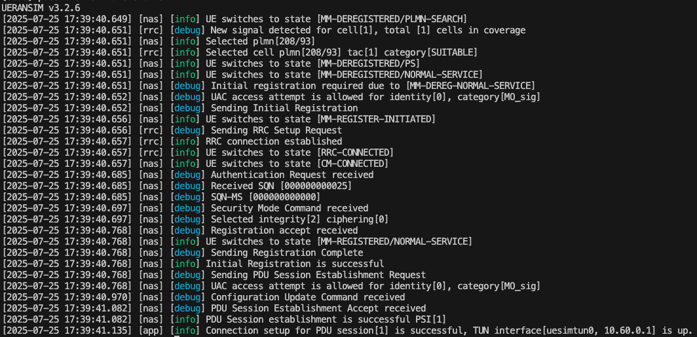

# 利用 Custom eBPF-based Schedulers 改善網路效能

>[!NOTE]
> Author: [Ian Chen](https://www.linkedin.com/in/ian-chen-88b70b1aa/)
> Date: 2025/07/26
---

Linux Kernel 自 v6.12 開始支援 sched_ext，它允許使用者藉由 eBPF 程式來定義自訂的 CPU 排程器。這個功能使得開發者能夠創建更靈活和高效的排程策略，以滿足特定的性能需求。
筆者深受 scx 專案的啟發，並且參考 [scx_rustland](https://github.com/sched-ext/scx/tree/main/scheds/rust/scx_rustland) 的概念，實作了讓開發者能夠使用 golang 語言來撰寫自訂排程器的框架 [scx_goland_core](https://github.com/Gthulhu/scx_goland_core)。

## scx 與 5G 領域結合的可能性

對於 5G 與 scx 的結合，已經有些許討論 [[1]](https://free5gc.org/blog/20250305/20250305/) [[2]](https://free5gc.org/blog/20250509/20250509/) [[3]](https://lwn.net/Articles/1027096/)。然而，考慮到現代 Cloud-Native App (5G Core Network) 的特性，目前尚沒有相關案例探討 scx 如何在雲原生架構上運作。

*圖一：API 架構*

對此，筆者提出了一個初步的想法，基於 scx_goland_core 框架開發了一個可在雲原生環境中運行的自訂排程器 [Gthulhu](https://gthulhu.github.io/docs/)，它可以部署於 Kubernetes 群集中，透過部署的方式管理叢集中大量節點的排程策略。

我們可以透過 Restful API 對 Gthulhu API server 下達排程策略，讓 API server 為我們找出需要調整的 workloads。與此同時，Gthulhu 會定期向 API server 發送心跳訊息，並在必要時更新排程策略。

> 關於 Gthulhu 的詳細資訊，請參考 [Gthulhu Docs](https://gthulhu.github.io/docs/how-it-works.en/)。

## 牛刀小試：觀察 Gthulhu 載入後資料層的效能差異

在本次實驗中，筆者的機器運作 在 Ubuntu 24.04 LTS 上，使用 Linux Kernel 6.12。實驗的目的是觀察 Gthulhu 在載入後對資料層效能的影響。

試驗環境如下：

- VM1 (Ubuntu 24.04 LTS, Linux Kernel 6.12)
    - 部署 free5GC v4.0.1
- VM2 (Ubuntu 20.04 LTS, Linux Kernel 5.4.0)
    - 部署 UERANSIM

待 PDU Session 建立後，筆者使用 `ping` 工具對 UPF N6 介面進行測試，並觀察在載入 Gthulhu 前後的延遲變化。

載入前，Linux 預設的排程器為 EEVDF，RTT 相關參數如下：

- rtt min = 1.263 ms
- rtt avg = 1.907 ms
- rtt max = 6.405 ms
- rtt mdev = 0.657 ms

rtt min/avg/max/mdev = 1.222/1.864/3.771/0.433 ms
載入 Gthulhu 後，RTT 參數變化如下：

- rtt min = 1.222 ms
- rtt avg = 1.864 ms
- rtt max = 3.771 ms
- rtt mdev = 0.433 ms

由此可見，載入 Gthulhu 後，RTT 的平均值和最大值均有所下降，顯示出 Gthulhu 在資料層的排程上確實有助於降低延遲。

## 結論

5G 提出了網路切片的概念，期待透過將實體網路切分成多個虛擬網路來提供不同的服務品質。有了 Gthulhu 這樣的自訂排程器，我們可以更靈活地管理和優化這些虛擬網路的性能，將不同業務需求的 UPF 部署在不同的節點上，並根據實際需求調整排程策略。

## 關於作者

Ian Chen 是一名熱衷於開源技術的開發者，專注於 5G 和雲原生架構的研究。他發起了 [Gthulhu](https://gthulhu.github.io/docs/) 專案，同時也是 free5GC 的主要貢獻者，致力於推廣和實現 5G 網路的開源解決方案。