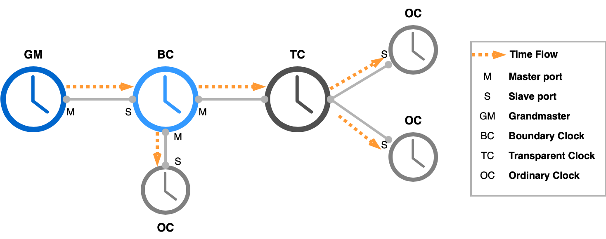
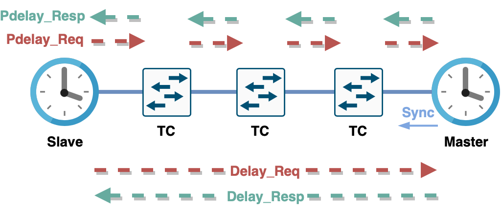

# Support of Time Sensitive Communication and Time Synchronization in 5G system - Introduction (Rel-17)

>[!NOTE]
> Author: Ya-shih Tseng
> Date: 2023/9/27

Before you read the article, I suggest you to read  [Time-Sensitive Networking over 5G system - Introduction (Rel-16)](https://free5gc.org/blog/TSN/). 

## Overview
This article will introduce TSN enhancements in 3GPP Release 17. We will start by discussing the new roles introduced in 5GS and their applicable scenarios. The architecture has been modified to accommodate a wider range of applications, and additional network functions have been added to offer a broader range of services. 

> Architcture to enable time sensitive communication and time synchronization

## 5GS can be as Boundary Clock and Transparent Clock
> Time Synchronization: describes how 5GS can operate as a PTP Relay (IEEE 802.1AS), as a Boundary Clock or as Transparent Clock (IEEE 1588) for PDU Session type Ethernet and IP.

According to 3GPP TS 23.501 Release 17, 5GS's role in TSN goes beyond just acting as a bridge. It now extends to UDP/IP applications. In addition to its original support for Ethernet through IEEE 802.1AS Time-Aware System, it has been updated to include four types of PTP instances described in IEEE 1588.

#### What is BC and TC?

> Difference types of PTP instances (clocks).

- For the BC, you can have a GM as a time source, and it can also act as a time source itself, allowing other slave clocks to synchronize their time with it.
- For the TC, it doesn't need to synchronize its time with other clocks. Its role is to receive time from one end, potentially adjust it, and then forward it to the next clock

For more detail about PTP instance / Clock types, please check [IEEE 1588v2 PTP Support](https://content.cisco.com/chapter.sjs?uri=%2Fsearchable%2Fchapter%2Fcontent%2Fen%2Fus%2Ftd%2Fdocs%2Frouters%2Fasr1000%2Fconfiguration%2Fguide%2Fchassis%2Fxe-16-5%2Fasr1000-software-config-guide-16-5%2F1588v2-ptp-asr.html.xml&query=ptp#con_1196705).

To support above applications, DS-TT and NW-TT have expanded their functionalities.

## Capability of DS-TT and NW-TT

With release 17 now supporting for the scenarios when Master clock is behind the UE (uplink time sync, UE – UE time sync), behind the network (downlink time sync) and support for multiple (g)PTP domains. 

>[!NOTE]
>In release 16, the roles of 5GS, DS-TT, and NW-TT are fixed. The Data Network side follows the TSN master, while the UE side follows the slave. When a packet enters, the entry time is first recorded in NW-TT, and the exit time is recorded in DS-TT. The difference between these two times determines the packet's resident time.

In general case, when receiving PTP event messages from upstream PTP instances, the ingress TT (NW-TT or DS-TT) records an ingress timestamp (TSi) for each PTP event, such as Sync messages. Then, NW-TT determines whether to forward messages to DS-TT or discard it.

Subsequently, the egress TT creates an egress timestamp (TSe) for PTP events (i.e., Sync messages) in the external PTP network and modifies the payload of the PTP message to add/update the resident time.

- As for 5GS operates as BC, NW-TT and DS-TT should support **generate** Sync, Follow_Up and Announce message. If DS-TT doesn't support it, NW-TT will take over.

### PTP transparent
TTs can support the following PTP transport modes described in IEEE 1588:
- over UDP/IPv4
- over UDP/IPv6
- over IEEE 802.3 (Ethernet)

### Delay measurements
Different PTP instances have different measurements of path delay due to hardware limitations.

TTs should support the following delay measurements as described in IEEE 1588:
- Delay request-response mechanism
- Peer-to-peer delay mechanism
  - which we talked about it in previous article.

Let's see what's the diference between them.

> Difference measurements of path delay
- For E2E (End-to-End) slaves send delay requests to the Master, passing through other devices in the network. Each TC (Transparent Clock) modifies the request to update the time it has spent locally. Finally, it reaches the Master, so the E2E measured delay represents the total time taken along the entire path.
- For P2P (Point-to-Point) devices, they send requests to nearby neighbors to measure the delay time between each other.

By now, We introduce few supports for PTP instances. Then, How should these functionalities be managed?

## Time Sensitive Communication and Time Synchronization Function
In release 16, TSN AF is used for exchanging messages to manage TSN bridges in conjunction with centralized network configuration (CNC). This means that TSN AF is responsible for managing the ports of DS-TT and NW-TT. Additionally, in release 17, **TSCTSF is a new component introduced between PCF and NEF. To support AF requests related to time-sensitive communication.**

TSCTSF can check the PTP functionalities supported by DS-TT and NW-TT by retrieving the following port management information or user plane node management information:
- Supported PTP instance types;
- Supported transport types;
- Supported PTP delay mechanisms;
- Grandmaster capability;
- Supported PTP profiles;
- Number of supported PTP instances.

AF can obtain the required services directly or indirectly through TSCTSF
- e.g. AF can provide traffic pattern parameters to NEF. NEF will forward the received traffic pattern parameters to TSCTSF.
- e.g. AF trusted by the operator can directly provide such traffic pattern parameters to TSCTSF.

TSCTSF may support AF to
- Activate and deactivate the time syncgronization services
- Control the time synchronization service for target UE.
- Configure the TTs to operate on AF-selected method
  - Managing the DS-TT and NW-TT via exchange of PMIC and UMIC
- Provide specific QoS traffic pattern
  - Creating the TSC Assistance Container based on individual traffic pattern parameters from the NEF/AF and providing it to the PCF.

## Abbreviation

|   |   |
|---|---|
|TSN|Time-Sensitive network|
|TT|TSN Translator|
|NW-TT|Network-Side TSN Translator|
|DS-TT|Device-Side TSN Translator|
|PTP|Precision Time Protocol|
|BC|Boundary Clock|
|E2E-TC|End-to-End Transparent Clock|
|P2P-TC|Peer-to-Peer Transparent Clock|
|GM|Grand Master|
|AF|Application Function|
|TSCTSF|Time Sensitive Communication and Time Synchronization Function|
|PMIC|Port Management Information Container|
|UMIC|User Plane Node Management Information Container|

## Conclusion
Release 17 expanded and improved the integration with IEEE TSN. This included enabling uplink synchronization through the 5G System (5GS), enhancing End-to-End Quality of Service (QoS) across multiple clock domains, and facilitating direct communication between UE within the 5GS network.

## Reference
- IEEE Std 802.1AS-2020: “IEEE Standard for Local and metropolitan area networks--Timing and Synchronization for Time-Sensitive Applications”.
- IEEE Std 1588: “IEEE Standard for a Precision Clock Synchronization Protocol for Networked Measurement and Control Systems”, Edition 2019.
- 3GPP TS 23.501 v16.6.0: "System Architecture for the 5G System"
- 3GPP TS 23.501 v17.8.0: "System Architecture for the 5G System"
- 3GPP TS 23.502 v17.4.0: "Procedures for the 5G System"
- Time-Sensitive Networking (TSN) Task Group | - IEEE 802.1

## About
Hi, This is Ya-shih Tseng. I am currently researching the implementation of 5G TSN as part of my master's studies. Feel free to discuss with me.
- Here is my [linkedin profile](www.linkedin.com/in/yashihh-tseng)
