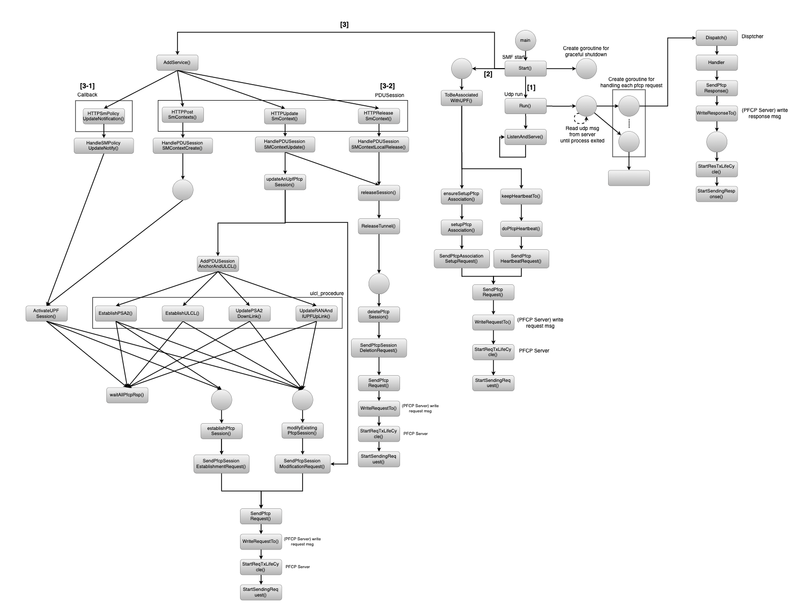

# SMF PFCP Software Architecture

>[!NOTE]
> Author: MingHsien Wu
> Date: 2024/02/09

## Introduction
Packet Forwarding Control Protocol(PFCP) is a communication protocol used in N4 interface of 5G core network. It is responsible for managing and controlling packet forwarding including functions such as traffic routing, Qos policy and session management. Typically, PFCP operates between control plane (SMF) and data plane (UPF), facilitating the exchange of control information and configuration commands.

The main focus of this blog is to share the software architecture diagram detailing how the PFCP server handles PFCP messages within the SMF. It will commence from the activation of the Network Function. Next, we will consider how free5GC operates in the software layer when receiving PFCP messages from the UPF and when the SMF needs to send PFCP requests.

### <u>Description</u>

When SMF is started, several software functionalities related to PFCP are activated. I mainly categorize them into three major directions: UDP (User Datagram Protocol) Run, N4 Interface Association, and Service-based interface handler (including PDU Session and Callback).

[1] **UDP Run :** 

   1. Read UDP msg from server until process exited :
      - When the PFCP Server receives a PFCP Request from the User Plane, the Server will hand over this message to the Dispatcher for processing, with the aim of generating the corresponding Response.

   2. Listen and Serve : 
      - Once the PFCP Server receives a PFCP Request from the Control Plane or User Plane, it will be monitored via ListenAndServe function. Depending on the circumstances, it will determine whether to pass it to the Dispatcher or the SMF’s sbi for handling.

[2] **N4 Interface Association :** 

   - The N4 interface association is used to maintain and verify the connectivity between the SMF and UPF. When either the SMF or UPF is first initialized, typically one of them will initiate an N4 association setup request. Subsequently, the SMF will initiate a Heartbeat Procedure to confirm whether the UPF is operational. If the UPF has not established an association with the SMF, the SMF will not process any PFCP Requests related to this UPF.

[3] **Service-based interface handler :**

   1. [3-1] ***Callback :***
      - The SMF (Subscriber) requests the establishment of an SM Policy association with the PCF (SBI). When subscription conditions are met (such as policy updates), the PCF will actively notify the SMF. Upon receiving this information, the SMF will also update the UPF according to the new policy.

   2. [3-2] ***PDU Session :***
      - (1) **Release** : When the Service Management Function (SMF) receives a PDU Session Release SMContext Request from the Access and Mobility Management Function (Possible scenarios include: AMF changes, an invalid SUPI from the UE, or the UE registering repetitively with the same AMF, etc.), The SMF will send an PFCP Session Deletion Request towards the User Plane Function (UPF) to release resources associated with this session.

      - (2) **Update** : When the Service Management Function (SMF) receives a PDU Session Update SMContext Request from the Access and Mobility Management Function for updating N3 tunnel information (Possible scenarios include: EPS to 5GS handover [TS23.502](https://www.tech-invite.com/3m23/toc/tinv-3gpp-23-502_zf.html#e-4-11-1-2-2-2), etc.), The SMF will send an PFCP Session Modification Request towards the User Plane Function (UPF) to update resources associated with this session.

      - (3) **Post** : When the Service Management Function (SMF) receives a PDU Session Create SMContext Request from the Access and Mobility Management Function (Possible scenarios include: UE Requested PDU Session Establishment), The SMF will send an PFCP Session Establishment Request towards the User Plane Function (UPF). If the SMF received Nsmf_PDUSession_CreateSMContext Request and the SMF is able to process the PDU Session establishment request, the SMF creates an SM context and responds to the AMF by providing an SM Context Identifier. [TS23.502](https://www.tech-invite.com/3m23/toc/tinv-3gpp-23-502_m.html#e-4-3-2-2)

   3. [3-3] ***ULCL Procedure*** : 
      - The insertion of ULCL (Uplink Control Channel) in 5G networks serves the purpose of facilitating the transmission of control information during uplink data transfer. ULCL enables the network to transmit control signals and indications during uplink transmission, effectively managing and controlling the allocation and scheduling of wireless resources. This includes transmitting scheduling information, establishing and releasing connections, modulation and coding information, among others, to ensure efficient control and management of uplink data transmission from user equipment.

## Reference

- *3GPP TS 23.502*: Procedures for the 5G System (5GS)
- *3GPP TS 29.244*: Interface between the Control Plane and the User Plane nodes

## About
Hello, I'm Hsien, a newcomer to free5gc. This is my first time sharing my experiment. If you find any mistakes or have any questions, please feel free to let me know. I would greatly appreciate it.

### Connect with Me

- Linkedin: [https://www.linkedin.com/in/wuminghsien/](https://www.linkedin.com/in/wuminghsien/)
- Github: [https://github.com/ming-hsien](https://github.com/ming-hsien)
