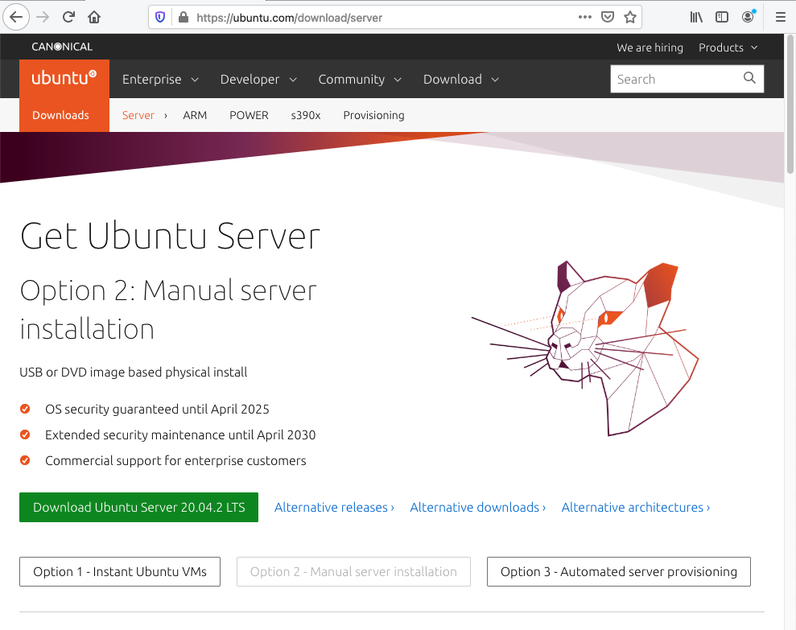
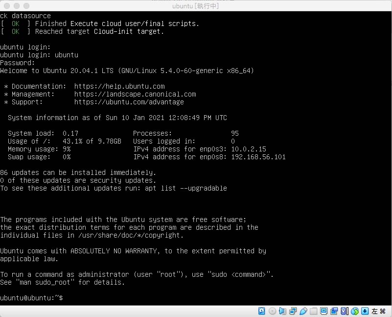
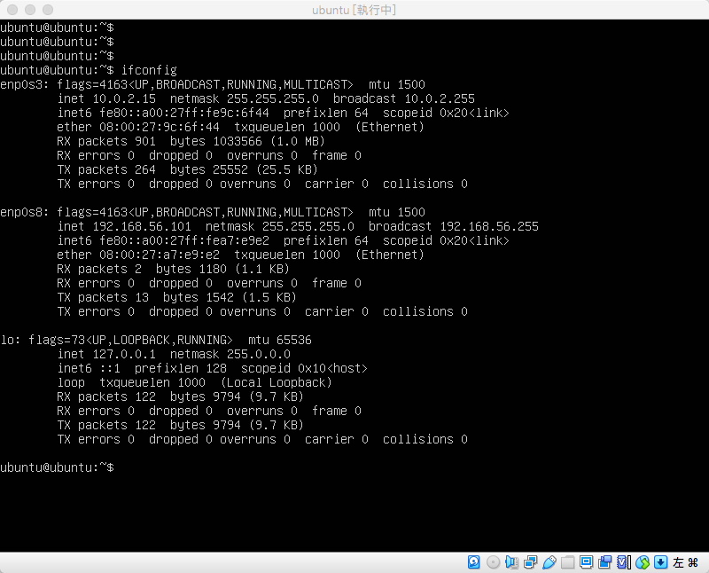
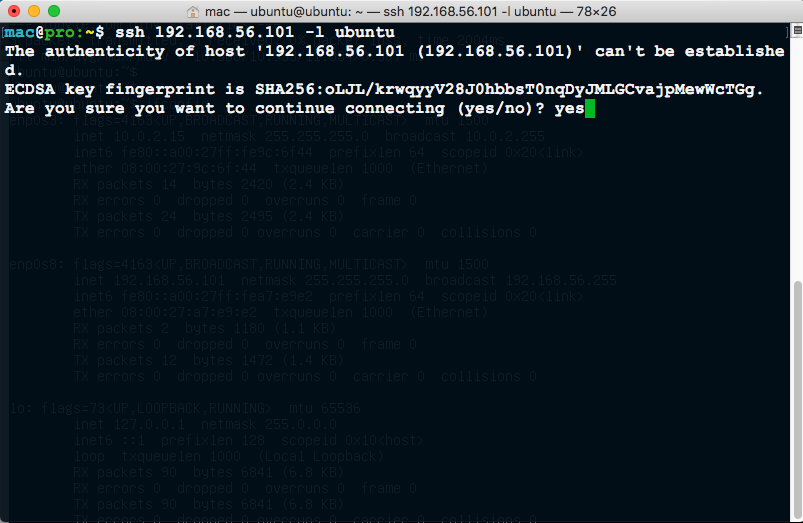
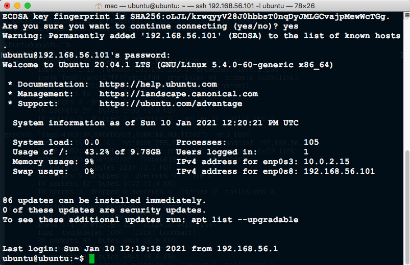
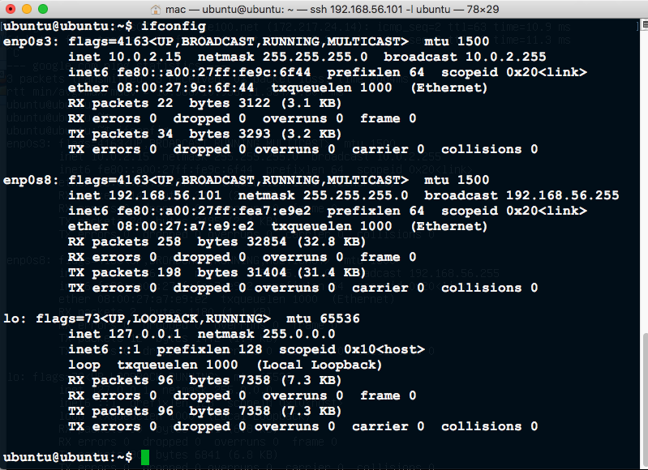

<!-- Google tag (gtag.js) --> <script async src="https://www.googletagmanager.com/gtag/js?id=G-JETJ7TJ805"></script> <script> window.dataLayer = window.dataLayer || []; function gtag(){dataLayer.push(arguments);} gtag('js', new Date()); gtag('config', 'G-JETJ7TJ805'); </script>

# Ubuntu Virtual Machine Installation Demo

In this demo, we will

- install VirtualBox
- create a Ubuntu Server VM using VirtualBox
- use SSH to connect to the Ubuntu VM to install free5GC stage 3
- Update and upgrade Ubuntu

## 1. Install VirtualBox

Search `virtualbox download`, or visit [virtualbox.org](virtualbox.org) to download and install VirtualBox (currently 6.1.18) for your operation system.


Once installed VirtualBox, launch and see if you have something like this:


## 2. Download Ubuntu Server

Search `ubuntu server download` on the web and download the latest Ubuntu Server LTS, or visit [ubuntu.com](ubuntu.com), choose Manual Installation Option to download the `.iso` file (currently 20.04.2 LTS)


You should have downloaded a `.iso image` file with name like `ubuntu-20.04.1-live-server-amd64.iso`, probably in your download directory.


## 3. Create a Ubuntu Server VM

Launch VirtualBox and create your first Ubuntu VM using the downloaded .iso image file. We use Ubuntu Server instead of Ubuntu Desktop because we only need a basic server machine without too many unnecessary functionalities. The resulting overhead to your host machine is smaller, and the VM starts up faster too.

> [!TIPS]
> - Name the first VM using a generic name as ubuntu, `ubuntu-server`, or `ubuntu-20.04`.
> - You can pick 1 or 2 (or more) CPUs, and about 2048M memory, although you can change them later.
> - In addition to the default NAT network interface, also add another “Host-only” network interface.
> 
> Refer to the videos [Creating VM](https://youtu.be/R-9vH_6VJ2Q), [Setting up VM](https://youtu.be/M-t_GbHd2EQ).

### 3.1 Start Installing Ubuntu
Some notes about installing Ubuntu:

- It is recommended that you choose short username and password for ease of typing later
- Not choosing LVM will make it a little bit easier later if you want to extend your disk space
- Choose to include SSH Server
- Let security update complete

Refer to videos [Install Ubuntu 1](https://youtu.be/L7Ue3QkSIYY), [Install Ubuntu 2](https://youtu.be/DR3ruEPUQjw).

### 3.2 Log in into Ubuntu
Reboot after Ubuntu installation complete; wait a little bit for some initialization steps complete. Then log in with your username and password.


First try the `ifconfig` command：
```
ubuntu@ubuntu:~$ ifconfig
Command 'ifconfig' not found, but can be installed with:
sudo apt install net-tools
ubuntu@ubuntu:~$
```

If some messages like above show, it means `ifconfig` has not been installed yet. (`ifconfig` is no longer installed by defaults in newer Ubuntu, and is replaced by more versatile ip command, but we will use it here for simplicity).

Follow its suggestion and install `ifconfig`:
```
ubuntu@ubuntu:~$ sudo apt install net-tools
```
Below shows the installation result:


Run `ifconfig` again to check the network interfaces:


Your display may look different, but take notes about the IP address of the Host-only interface card. The example above shows `192.168.56.101`. You can SSH from your host machine into this Ubuntu VM using the IP later. (Another IP address, `10.0.2.15` is the IP address of the NAT interface card, the apps in your host machine cannot access it).

Finally check if the VM has internet access:
```
ubuntu@ubuntu:~$ ping google.com
```


Refer to the first part of the video [Ping, SSH, and Upgrade](https://youtu.be/qa8A8z-DKZk).

## 4. Connect to the Ubuntu VM using SSH
Launch your favorite SSH client from the host machine.
Some operation systems (Mac, Ubuntu, some Windows) have pre-installed SSH clients. If you are using Windows, you can also download third-party SSH clients. For example, search “windows ssh download” on the web.

The benefit of using SSH is that you can easily copy and paste commands from your machine to Ubuntu VM for execution, and vice versa. You can also create multiple SSH connections with the Ubuntu VM for control and monitoring at the same time.

Below shows some examples on a Mac host machine. Suppose the Host-only network IP is `192.168.56.101`, and tue username is ubuntu:
```
ssh 192.168.56.101 -l ubuntu
```
The first time you connect to the VM, your SSH client may show some message asking you for confirmation. Enter **yes**:


> [!TIPS]
> If somehow SSH shows some warning messages telling you the machine has potential security risk, you may have to remove an entry in the file `<your home directory>/.ssh/known_hosts` related the the IP address.

If you log in successfully, you will enter a command line interface:


Repeat the basic commands such as `ping`, `ifconfig` to see if the VM is working properly. If so, we can access the Ubuntu VM “remotely” from now on.




## 5. Update and Upgrade your Ubuntu

Let also update and upgrade the Ubuntu VM right now to make sure it is up-to-date with proper security updates.
```
sudo apt update
sudo apt upgrade
```


