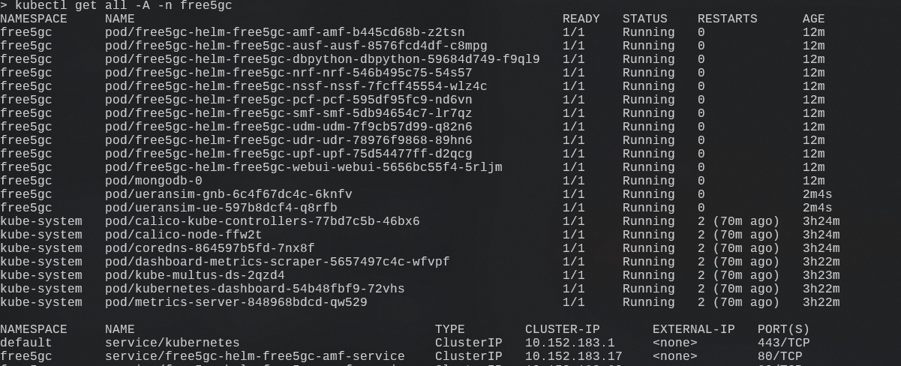

# free5GC Helm Installation
## Prerequirements
### Microk8s Installation
- Install packages
    ```
    sudo snap install microk8s --classic --channel=1.29/stable
    ```
- To [work with local kubectl](https://microk8s.io/docs/working-with-kubectl)
    ```
    sudo snap install kubectl --classic
    sudo snap install helm --classic
    microk8s config > ~/.kube/config
    su - $USER
    ```
- Verify the Installation 
    ```
    microk8s status --wait-ready
    ```
- Create namespace for free5gc
    ```
    kubectl create ns free5gc
    ```

### Network configuration
- Reference: [Toward5Gs -- Network Configuration](https://github.com/Orange-OpenSource/towards5gs-helm/tree/main/charts/free5gc#networks-configuration)
- This Helm chart requires two network interfaces: `eth0` and `eth1`
    - Both of them should have the ability to connect to the Internet
    - By default, one of them (`eth1`) will be the N6 network interface
- In Summary, the `value.yaml` in each configuration should be set up correctly
    - Suppose we have two NW interfaces:
        1. `eth0`: `172.19.244.39/20`
        2. `eth1`: `192.168.50.43/24`
    - We take `eth1` as the interface connected to DN, the following values should be changed:
        1. `global.n6network.subnetIP`, `global.n6network.gatewayIP`
        2. `free5gc-upf.n6if.ipAddress`
        3. For changing the interface, these values should be modified: `global.n2network.masterIf`, `global.n3network.masterIf`, `global.n4network.masterIf`, `global.n6network.masterIf`
    - `free5gc-helm/charts/free5gc/value.yaml`
        ```yaml
        global:
          n6network:
            enabled: true
            name: n6network
            type: ipvlan
            masterIf: eth1
            subnetIP: 192.168.50.0
            cidr: 24
            gatewayIP: 192.168.50.1
            excludeIP: 10.100.100.254
        ```
    - `free5gc-helm/charts/free5gc/charts/free5gc-upf/values.yaml`
        ```yaml
        upf:    
            n6if:  # DN
                ipAddress: 192.168.50.66
        ```
        - When choosing "ULCL" architecture for the user plane, `n6if` configuration in `upf1`, `upf2`, `upfb` should also be changed to the DN interface
    - These values could be setup by using `helm install --set`, see [helm chart installation](#Helm-Chart)

### CNI Plugin Configuration
- Starting from version 1.19, MicroK8s clusters use the **Calico CNI** by default ([ref](https://microk8s.io/docs/change-cidr)).
    - To enable IP forwarding on UPF, Calico CNI needs some necessary configurations.
    - Some CNI plugin, like Flannel, kube-ovn, allow this funtionality by default
- Setup Calico CNI for IP Forwarding
    1. `/var/snap/microk8s/current/args/cni-network/cni.yaml`
        ```yaml
        kind: ConfigMap
        data:
            cni_network_config: |-
                {
                    # Append IP forwarding settings
                    "container_settings": {
                        "allow_ip_forwarding": true
                    }
                }
        ```
    2. Apply settings
        ```
        kubectl apply -f /var/snap/microk8s/current/args/cni-network/cni.yaml
        ```
- **Otherwise,** Use `kube-ovn` CNI plugin
    ```
    sudo microk8s enable kube-ovn --force
    ```
    - [Official doc](https://microk8s.io/docs/addon-kube-ovn)

### multus-cni plugin
- Enables attaching multiple network interfaces to pods
    - [Github link](https://github.com/k8snetworkplumbingwg/multus-cni)
- [MicroK8s multus addons](https://microk8s.io/docs/addon-multus)
    ```
    microk8s enable community
    microk8s enable multus
    ```
- Reference Multus Guide
    1. [Multus - Create Network Definitions](https://github.com/k8snetworkplumbingwg/multus-cni/blob/v3.9/docs/how-to-use.md#create-network-attachment-definition)
    2. [Multus - Tell pods to use those networks via annotations](https://github.com/k8snetworkplumbingwg/multus-cni/blob/v3.9/docs/how-to-use.md#run-pod-with-network-annotation)
    

## Installation
### Create Persistent Volumn
- Use `kubectl apply` to declarative create persistent volume
    - `kubectl apply -f persistent-vol-for-mongodb.yaml`
    - `persistent-vol-for-mongodb.yaml`
        ```yaml
        apiVersion: v1
        kind: PersistentVolume
        metadata:
          name: example-local-pv9
          labels:
            project: free5gc
        spec:
          capacity:
            storage: 8Gi
          accessModes:
          - ReadWriteOnce
          persistentVolumeReclaimPolicy: Retain
          local:
            path: </path/to/storage>
          nodeAffinity:
            required:
              nodeSelectorTerms:
              - matchExpressions:
                - key: kubernetes.io/hostname
                  operator: In
                  values:
                  - <work-node-name>
        ```
        - directory on `/path/to/storage` should be created previously
- Check persistent volume
    ```
    kubectl get persistentvolume
    ```
    
### Helm Chart
- Enter the directory: `free5gc-helm/charts/`
- free5GC
    ```
    microk8s helm install -n free5gc free5gc-helm ./free5gc/ 
    ```
    - Install with customized interface settings
        ```
        helm install -n free5gc free5gc-helm ./free5gc/ \
        --set global.n6network.subnetIP="192.168.50.0" \
        --set global.n6network.gatewayIP="192.168.50.1" \
        --set free5gc-upf.upf.n6if.ipAddress="192.168.50.66"
        ```
- UERANSIM
    ```
    microk8s helm install -n free5gc ueransim ./ueransim/ 
    ```
- Verification
    - List installed charts
        ```
        helm ls -A
        ```
    - Check services, pods, repicaets, and deployments 
        ```
        kubectl get all -n free5gc 
        ```
- Check IP forwarding is avalible in upf
    ```
    kubectl exec -it -n free5gc deployment/free5gc-helm-free5gc-upf-upf \
    -- cat /proc/sys/net/ipv4/ip_forward
    ```
    - This output should be `1`
- Result
    


## Test
- Add subscribors via webui
    1. Port forwarding 
        ```
        kubectl port-forward svc/webui-service 5000:5000  --address 0.0.0.0
        ```
    2. access `<externel_ip>:5000`
        
- Ping externel network with tunnel 
    ```
    kubectl exec -it -n free5gc deployment/ueransim-ue -- ping -I uesimtun0 8.8.8.8
    ```
    
