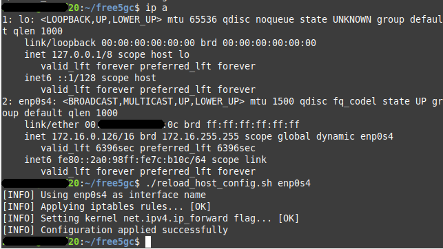

<!-- Google tag (gtag.js) --> <script async src="https://www.googletagmanager.com/gtag/js?id=G-JETJ7TJ805"></script> <script> window.dataLayer = window.dataLayer || []; function gtag(){dataLayer.push(arguments);} gtag('js', new Date()); gtag('config', 'G-JETJ7TJ805'); </script>

# Appendix
## Appendix A: OAM 
1. Run the OAM server
```
cd webconsole
go run server.go
```
2. Access the OAM by
```
URL: http://localhost:5000
Username: admin
Password: free5gc
```
3. Now you can see the information of currently registered UEs (e.g. Supi, connected state, etc.) in the core network at the tab "DASHBOARD" of free5GC webconsole

**Note: You can add the subscribers here too**

## Appendix B: Orchestrator
Please refer to [free5gmano](https://github.com/free5gmano)

## Appendix C: IPTV
Please refer to [free5GC/IPTV](https://github.com/free5gc/IPTV)

## Appendix D: System Environment Cleaning
The below commands may be helpful for development purposes.

1. Remove POSIX message queues
    - ```ls /dev/mqueue/```
    - ```rm /dev/mqueue/*```
2. Remove gtp5g tunnels (using tools in libgtp5gnl)
    - ```cd ./src/upf/lib/libgtp5gnl/tools```
    - ```./gtp5g-tunnel list pdr```
    - ```./gtp5g-tunnel list far```
3. Remove gtp5g devices (using tools in libgtp5gnl)
    - ```cd ./src/upf/lib/libgtp5gnl/tools```
    - ```sudo ./gtp5g-link del {Dev-Name}```

## Appendix E: Change Kernel Version
1. Check the previous kernel version: `uname -r`
2. Search for a specific kernel version and install (e.g. `5.0.0-23-generic`)
```bash
sudo apt update # make sure package lists are up to date
sudo apt search 'linux-image-5.0.0-23-generic'
```
Example output for the command above:
```bash
Sorting... Done
Full Text Search... Done
linux-image-5.0.0-23-generic/focal-updates,focal-security 5.0.0-23.126~20.04.1 amd64
  Signed kernel image generic
```
Install the new kernel image:
```bash
sudo apt install linux-image-5.0.0-23-generic linux-headers-5.0.0-23-generic
```
3. Update initramfs and GRUB
```bash
sudo update-initramfs -u -k all
sudo update-grub
```
4. Reboot, enter GRUB, and select the newly installed kernel version `5.0.0-23-generic`
```bash
sudo reboot
```
5. Reinstall the GTP-U kernel module on the new kernel version

Follow the `Retrieve the 5G GTP-U kernel module using git and build it` instructions of the [install guide](./3-install-free5gc.md#c-install-user-plane-function-upf)
#### Optional: Remove Kernel Image
```
sudo apt remove linux-image-5.0.0-23-generic linux-headers-5.0.0-23-generic
```

## Appendix F: Program the SIM Card
Install packages:
```bash
sudo apt-get install pcscd pcsc-tools libccid python-dev swig python-setuptools python-pip libpcsclite-dev
sudo pip install pycrypto
```

Download PySIM
```bash
git clone git://git.osmocom.org/pysim.git
```

Change to pyscard folder and install
```bash
cd <pyscard-path>
sudo /usr/bin/python setup.py build_ext install
```

Verify your reader is ready

```bash
sudo pcsc_scan
```

Check whether your reader can read the SIM card
```bash
cd <pysim-path>
./pySim-read.py –p 0
```

Program your SIM card information
```bash
./pySim-prog.py -p 0 -x 208 -y 93 -t sysmoUSIM-SJS1 -i 208930000000003 --op=8e27b6af0e692e750f32667a3b14605d -k 8baf473f2f8fd09487cccbd7097c6862 -s 8988211000000088313 -a 23605945
```

You can get your SIM card from [**sysmocom**](https://shop.sysmocom.de/SIM/).

## Appendix G: Install MongoDB 7.0.x on Ubuntu Server 22.04.03

Check that the system CPU supports AVX instructions as it's required since MongoDB 5.0. If not (i.e. the command below returns empty output), use MongoDB 4.4.x (see step 3 from [installation prerequisites instructions](https://free5gc.org/guide/3-install-free5gc/#a-prerequisites))

```bash
grep --color avx /proc/cpuinfo
```

Before you begin the installation, update the package manager database and make sure MongoDB prerequisites are installed
```bash
sudo apt update
sudo apt install gnupg curl
```
Add MongoDB public GPG key
```bash
curl -fsSL https://pgp.mongodb.com/server-7.0.asc | \
   sudo gpg -o /usr/share/keyrings/mongodb-server-7.0.gpg --dearmor
```
**Note:** if you are installing a version other than 7.0, remember, change it on the command above

Create the APT list entry file using the command below
```bash
echo "deb [ arch=amd64,arm64 signed-by=/usr/share/keyrings/mongodb-server-7.0.gpg ] https://repo.mongodb.org/apt/ubuntu jammy/mongodb-org/7.0 multiverse" | sudo tee /etc/apt/sources.list.d/mongodb-org-7.0.list
```

Refresh the package database then install MongoDB

```bash
sudo apt update
sudo apt install -y mongodb-org
```

For detailed instructions on how to freeze the installed version or install a specific version of MongoDB, please, check the reference below or [follow this direct URL](https://www.mongodb.com/docs/manual/tutorial/install-mongodb-on-ubuntu/#install-the-mongodb-packages)

Don't forget to load the DB service using

```bash
sudo systemctl start mongod
```

Reference: [MongoDB official website](https://www.mongodb.com/docs/manual/tutorial/install-mongodb-on-ubuntu/)

## Appendix H: Using the `reload_host_config.sh` script

The script was designed to help reapplying [the configurations](./5-install-ueransim.md#7-testing-ueransim-against-free5gc) after a VM reboot

### Usage

Its usage is fairly simple, just run

```bash
cd ~/free5gc # go back to free5gc's main folder
sudo reload_host_config.sh <dn_interface>
```

For example, if your DN interface (e.g. free5GC's VM LAN interface) is called `enp0s4`, the command above will be

```bash
sudo reload_host_config.sh enp0s4
```

**Note:** In Ubuntu Server 20.04 and 22.04 the dn_interface may be called `enp0s3` or `enp0s4` by default

If you are unsure about the interface name, run `ip a` to help to figure it out (see the image below)



An example of the expected output is depicted above

### Reset iptables rules

There is a parameter to completely reset the firewall rules (by default, the script only appends free5gc's required rules)

Just add `-reset-firewall` to the script input

```bash
sudo reload_host_config.sh enp0s4 -reset-firewall
```

So it will clear all rules, then apply the required rules
