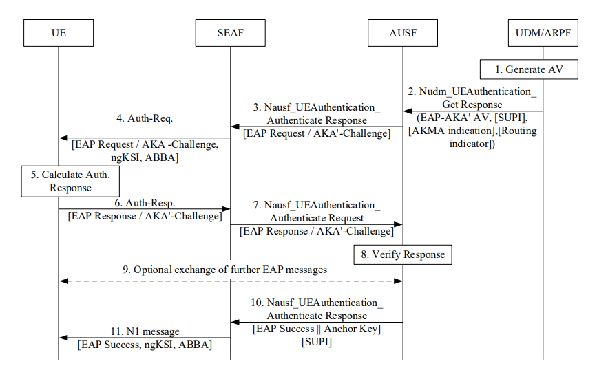

# SMF PFCP Software Architecture

>[!NOTE]
> Author: TingYuan Chou
> Date: 2024/03/02

## Introduction
The Authentication Server Function (AUSF) plays a critical role in the security framework of 5G networks, particularly in handling the authentication of User Equipment (UE). It serves as a central entity that facilitates the authentication process between the UE and the network, ensuring that only authorized users gain access. This process involves the generation and verification of authentication vectors, and the implementation of the 5G AKA (Authentication and Key Agreement) protocol.

This blog aims to shed light on the software architecture surrounding the AUSF's handling of UE authentication requests. We will explore how the AUSF operates within the 5G core network, focusing on its interactions with other network functions such as the Unified Data Management (UDM) and the Network Repository Function (NRF). Additionally, we will delve into the flow of authentication messages, the security mechanisms in place, and how the AUSF manages sessions and security contexts.

### <u>Description</u>

When the AUSF (Authentication Server Function) is initiated within a 5G network, it activates several key functionalities crucial for managing the authentication and security of User Equipment (UE). These functionalities can be broadly categorized into three main areas: Secure Communication Setup, Authentication Protocol Handling, and Service-based Interface Management. Each of these areas plays a vital role in ensuring that the AUSF effectively secures network access and communication.

[1] **Listen and Serve :** 

   - Once the AUSF receives an authentication request, typically from the AMF (Access and Mobility Management Function) as part of the 5G security procedures, it will be processed through a secure communication channel. The AUSF listens for incoming authentication requests through its service-based interface, ensuring secure and reliable transport, often utilizing protocols like HTTPS for secure transmission over the network.

[2] **Service-based interface handler for AUSF :**

   1. [2-1] ***UE Authentication :***
      - (1) **EAP-AKA** :  The EAP-AKA' authentication process, as detailed in RFC 5448 and 3GPP TS 33.501, is a sophisticated mechanism designed to ensure secure communication between the User Equipment (UE) and the network. This process involves several steps, starting with the generation of an authentication vector (AV) by the Unified Data Management/Authentication Repository and Processing Function (UDM/ARPF), and culminates in the successful establishment of a secure session between the UE and the network.

      
      > Authentication procedure for EAP-AKA, described in *3GPP TS 33.501 clause 6.1.3.1*
      
      The EAP-AKA' authentication sequence unfolds as follows, correlating with the sequence diagram above which is depicted in [TS33.501](6.1.3.1)

      - **Authentication Vector (AV) Creation:** Initiated by the UDM/ARPF generating a tailored AV.
      - **AV Transmission to AUSF:** The AV is sent to the AUSF, signaling readiness for authentication.
      - **Challenge Issuance and UE Response:** The AUSF challenges the UE, which then responds, showcasing its authenticity.
      - **Response Verification:** The AUSF verifies the UE's response, a crucial step for security.
      - **Secure Session Establishment:** Successful verification leads to establishing a secure session.

      - (2) **5G-AKA** : The 5G AKA authentication procedure enhances the security mechanisms of previous generations (EPS AKA) by incorporating additional steps and checks to verify the identity of the UE and establish a secure session. This process, as outlined in the provided diagram, includes the generation of authentication vectors, challenge and response exchanges, and the final confirmation of a successful authentication.

      
      > Authentication procedure for 5G AKA , described in *3GPP TS 33.501 clause 6.1.3.2*
      
      The authentication procedure unfolds as follows, aligned with the flow above which is depicted in [TS33.501](6.1.3.2)

      - **Authentication Vector (AV) Creation:** The UDM/ARPF generates a 5G AV, initiating the process.
      - **AV Transmission to AUSF:** The AV is dispatched to the AUSF to begin the authentication challenge.
      - **Challenge Issuance and UE Response:** The AUSF challenges the UE, which must respond accurately.
      - **Response Verification:** The AUSF verifies the UE's response, ensuring the authentication's integrity.
      - **Secure Session Establishment:** Upon successful verification, a secure session is established with the UE.

      - (3) **Post** : This function handles post-authentication requests from the UE, such as re-authentication or authentication status queries. It ensures that the UE's authentication state is correctly managed throughout its network stay, facilitating continuous security assurance.

   2. [2-3] ***Authentication Context Management*** : 
      - An essential function for retrieving the authentication context of a specific UE. This context includes the UE's authentication status, any stored vectors or keys, and the current security context. It's used by the AUSF to fetch the latest authentication information for decision-making processes, ensuring that the UE's interactions with the network remain secure and personalized. This function is vital for operations requiring an understanding of the UE's current authentication and security state, including session updates, security policy enforcement, and during handovers or network re-entries.

## Reference

- *3GPP TS 23.509*: Authentication Server Services (5G System)
- *3GPP TS 33.501*: Security architecture and procedures for 5G System

## About
Greetings, I'm Chou, a newcomer to free5gc. I'm excited to share my experiment for the first time. If you spot any errors or have any questions, please don't hesitate to reach out. Your feedback is greatly appreciated.

### Connect with Me

- Linkedin: [https://www.linkedin.com/in/%E5%AE%9A%E9%81%A0-%E5%91%A8-4b3800193/](https://www.linkedin.com/in/%E5%AE%9A%E9%81%A0-%E5%91%A8-4b3800193/)
- Github: [https://github.com/TYuan0816](https://github.com/ming-hsien)
