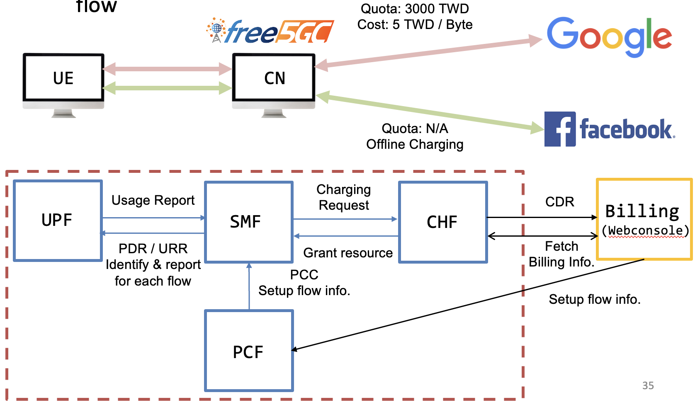

# CHF Design Document

>[!NOTE]
> Author: [Ian Chen](https://www.linkedin.com/in/ian-chen-88b70b1aa/), [Andy Chen](https://www.linkedin.com/in/tsung-fang-chen-437a71191/)

If you're interested in a brief overview of the charging system, please refer to the previous tech blog: [link](https://free5gc.org/blog/20230913/20230913/).

The charging functionalities have been supported since *free5GC v3.4.1*.
We implement the converged charging system (CHF) and several changes:

- [Add Billing Domain in webconsole](https://github.com/free5gc/webconsole/pull/58)
- [PCF supports to generate charging info in SM Policy decision](https://github.com/free5gc/pcf/pull/12)
- [SMF supports PDU-Session level Online/Offline charging](https://github.com/free5gc/smf/pull/94)

## Usage Report

Online and Offline charging rely on the usage report(s) reported from UPF to SMF via the PFCP Session Report (defined in *3GPP TS 29.244*).
The feature of the usage report has been supported since *v3.3.0*; the key points of the design are listed below:

- URR's (Usage Reporting Rules) ID in the range of 0 ~ 5 is preserved for default settings:
    - ID `0` for MBQE (Measurement Before QoS Enforcement) of the single UPF.
    - ID `1` for MAQE (Measurement After QoS Enforcement) of the single UPF.
    - ID `2` for MBQE of the branching UPF (ULCL).
    - ID `3` for MAQE of the branching UPF (ULCL).
    - ID `4` for MBQE of the anchor UPF (ULCL).
    - ID `5` for MAQE of the anchor UPF (ULCL).
    
- Uplink and Downlink PDRs share the same URR.

- The URR ID of the charging URR will be 6 or greater number.

- If the charging method is **Online Charging**:
    - The URR has the Start of the SDF (Service Data Flow) trigger.
    
    - When the UPF receives the first packet of the data flow, then UPF will send the notification to SMF to get the transmission reservation quota/volume.
    
    - Once the usage reaches the threshold (a little below quota),  UPF tries to renew the reservation quota/volume and updates the actual usage to SMF. 
    
    - If the SMF finds out that the session is out of quota, the UPF will not get the quota, and the UPF will drop all of the data in the flow.
    
    - The related settings are in the SMF configuration file: 
    
        - ```requestedUnit``` indicates how many byte doses one reservation is reserved. 
    
        ```yaml
        configuration:
        	smfName: SMF
          requestedUnit: 1000 # The unit per quota reservation 
        ```
    
- If the charging method is **Offline Charging**:
    - The URR indicates the volume threshold and time period.
    - Offline charging only needs UPF to report the usage of the flow. 
    - The related settings are in the SMF configuration file: 
    
        - ```urrPeriod``` indicates how many seconds doses URR periods.
        -  ```urrThreshold``` indicates how many bytes doses URR threshold.
        
        ```yaml
        configuration:
        	smfName: SMF
        	urrPeriod: 10       # default usage report period in seconds
          urrThreshold: 1000  # default usage report threshold in bytes
        ```
## Main characters in the charging system



- Webconsole is a Billing Domain system, that can collect the CDR files from CHF via FTP protocol.
- PCF is responsible for allocating the rating group; the rating group generator is globally unique.
- SMF is CTF (Charging Trigger Function) in our use case.
    - SMF can find the rating group by using URR ID, which helps SMF grant the new quota from CHF by triggering the charging data request.

## Charging on PDU Session

Although 3GPP defined the FBC (Flow-Based Charging) and QBC (QoS Flow-Based Charging),
But free5GC now only supports the FBC on the data usage of PDU Session(s), So we will focus on the FBC in this document.

2 levels of triggers can be supplied by the CHF:

- [ ] Triggers associated with the PDU session.
- [x] Triggers associated with a rating group within the PDU session.


> PDU session establishment, described in *3GPP TS 32.255 clause 5.2.2.2.2*

Charging on PDU Session is achieved by **FBC charging, with specific rating group/service identifier**:

- As we mentioned, the rating group will be allocated by PCF during the SM Policy Authorization (Step 6 in the figure above).
    - PCC Rule for charging additionally indicates the rating group, SDF template, and charging method.
- After the UPF selection, SMF sends the Charging Data Request to initiate the charging session and also applies the data plane rules to UPF via N4 Session Establishment/Modification.
-  When the first uplink data comes to UPF, it will trigger the Charging Data Request [Update] to update the CDR file.

## Others

- For ULCL deployment, only the data usage of the PSA-UPF will be charged (it avoids charging the same data packet twice).
- In our implementations, UPF is composed of the `go-upf` (Controller) and `gtp5g` (Executor).
    - `gtp5g` sends the usage report to `go-upf` via unix socket.
    - `gtp5g` is able to send multiple reports at once, which reduces the communication effort in UPF.