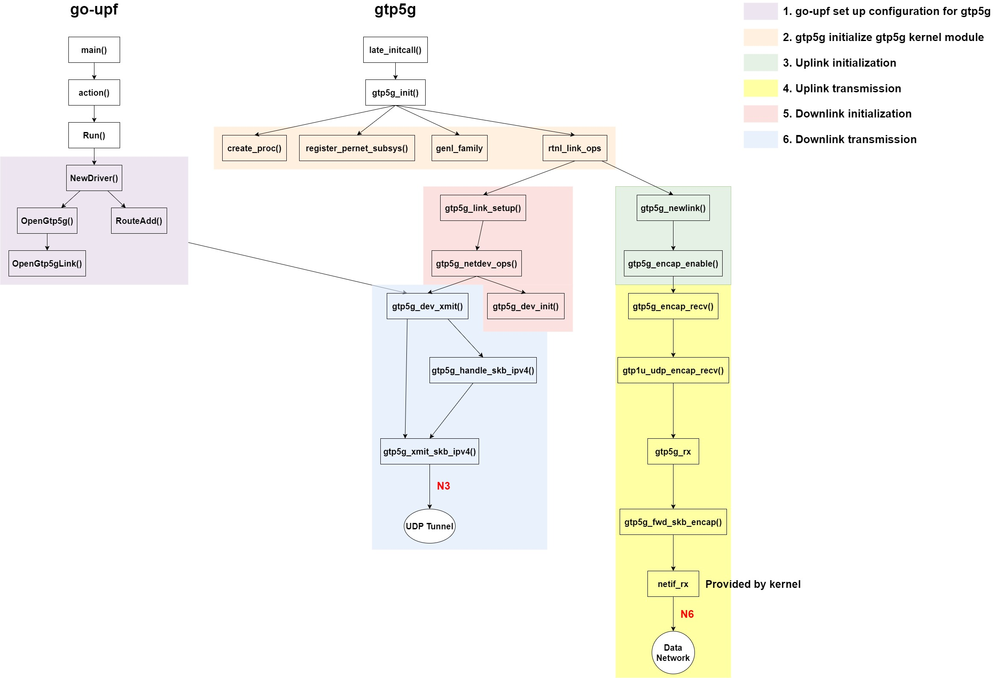

# UPF Design Document
>
>[!NOTE]
> Author: HanHung Chen
> Date: 2024/03/13

## Introduction

***The User Plane Function (UPF)*** plays a crucial role in data transfer within the 5G network. It is interconnected with the Data Network (DN) in the 5G architecture. As a primary network function (NF) of the 5G core network (5GC), it handles the most critical aspects of data processing. It is responsible for packet routing and forwarding, packet inspections, quality of service (QoS) handling, and an anchor point for intra & inter-RAT mobility, with new functions on the horizon.
UPF has N3, N4, N6 and N9 four interfaces. Their usages are below:

- N3: Interface between RAN and the UPF. N3 is based on the GTP-U protocol.
- N4: Interface between Session Management Function (SMF) and the UPF. N4 is based on the PFCP protocol.
- N6: Interface between DN and UPF.
- N9: Interface between two UPFs.

The free5GC implements UPF in two parts, which are:

- Control plane: GO-UPF (N4)
- Data plane: GTP5G (N3, N6, N9)

***GTP5G*** is a communication protocol essential for data transmission within the 5G core network. It operates on the user plane, which is responsible for transporting user data between user equipment and the Internet.

This article will focus on the Data plane. Discuss how GO-UPF and GTP5G  handle packets within uplink and downlink transmission.

## free5GC Uplink and Downlink Processing Workflow


[1] **GO-UPF configuration**

- ```NewDriver()```
  - In addition to initializing a GTP5G device for handling uplink and downlink packets, it is also necessary to configure the corresponding routes for this device.

- ```OpenGtp5gLink()```
  - The function `OpenGtp5gLink()` passes the UDP Socket representing N3, accessed through f.Fd(), as a parameter in the `IFLA_LINKINFO` message to the gtp5g kernel module in the kernel space. The gtp5g module then uses this socket to establish a UDP tunnel for N3.
- ```RouteAdd()```
  - Add the corresponding route for the N6 Downlink, it indicates all of the traffic, sent to UE, will proceed by the gtp5g network device.

[2] **gtp5g_init() initializes gtp5g kernel module:**

- ```create_proc()```
  - The Proc filesystem is a virtual filesystem that allows userspace programs to access kernel data structures and state.

- ```register_pernet_subsys()```
  - The `register_pernet_subsys()` function is used to register a pernet subsystem. A pernet subsystem is a framework for managing network namespaces. This allows the gtp5g module to run in different network namespaces.

- ```generic family```
  - The gtp5g_genl_family structure is used to define a generic netlink family. A generic netlink family is a way for userspace programs to communicate with the kernel.

- ```rtnl_link_ops```
  - The rtnl_link_ops structure is used to define operations related to network devices.

[3] **Uplink initialization**

1. ```gtp5g_newlink()```
    - Used to build N3 UDP tunnel and register a new gtp5g device.

2. ```gtp5g_encap_enable()```
    - Bind UDP socket for receiving N3 packet.

[4] **Uplink transmission**

1. ```gtp5g_encap_recv()```
   - At the end of gtp5g_encap_enable function:
    ```tuncfg.encap_rcv = gtp5g_encap_recv;``` \
    it indicates that ```gtp5g_encap_recv()``` function is responsible for handling UDP tunnel receiving packet.

2. ``` gtp1u_udp_encap_recv()```
   - The function handles packets encapsulated by GTP protocol.
   
3. ``` netif_rx()```
   - Provided by the kernel, it sends the packets through the N6 interface.

[5] **Downlink initialization**

1. ```gtp5g_link_setup() ```
   - Set up net device.
2. ```gtp5g_netdev_ops ```
   - It's a structure that defines how gtp5g deals with N6 packets.
3. ``` gtp5g_dev_init()```
   - It is called after the net device is registered and initializes some of the device's status.

[6] **Downlink transmission**

1. ```gtp5g_dev_xmit()```
    - This function is defined by `gtp5g_netdev_ops` so it is called when a packet needs to be transmitted.
2. ```gtp5g_handle_skb_ipv4()```
   - It will query the PDR based on the destination IP. If found successfully, the FAR will then be checked to determine how to handle the packet.
3. ```gtp5g_xmit_skb_ipv4()```
   - If FAR action is confirmed as `FAR_ACTION_FORW`, the function `gtp5g_xmit_skb_ipv4()` will be called and packets will be sent to the UDP tunnel.
