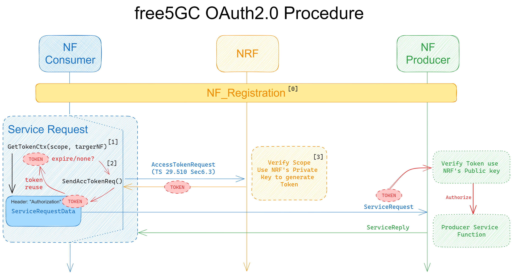

# free5GC OAuth2 Design

>[!NOTE]
> Author: Andy Chen (CTFang, Tsung-Fang Chen)
> Date: 2024/02/22

We release **OAuth2** on SBI in *free5GC* [v3.4.0](https://github.com/free5gc/free5gc/releases/v3.4.0). This article shows you how we design OAuth2 in *free5GC*. 

This is the OAuth2 Procedure we released in the [blog](./../../blog/20231115/free5GC_OAuth2_Procedure.md).




## Token/Key Management

- The NRF utilizes its **private key** to **generate** tokens.
- NF Service Producers utilize the NRF's **public key** to **validate** the tokens.

Instead of using the NF's public key to generate tokens, we opt for a simpler key management approach.

In this design, the NRF only needs to securely store its private key, while other NFs only need to know the location of the NRF's certificate. This simplifies key management for the NRF, as it avoids the need to manage numerous NF public keys.


## Enable OAuth2

### NRF

- NRF acts as the decider on whether to use OAuth2 in the service-based interface (SBI). 
- First, we should set ```oauth``` in the NRF configuration file. 

```yaml
configuration:
  sbi: # Service-based interface information
    oauth: true
```

- When NFs initiate **NF_Registration**, then NRF would put the ```oauth2``` setting in ```customInfo```, an element of NFProfile, back to NFs. 


### NFs

We use part of the SMF code, for explanation. 

- **Service Consumer**
    
    - We define ```GetTokenCtx()``` in each NF. 
    
    ```go
    func (c *SMFContext) GetTokenCtx(serviceName models.ServiceName, targetNF models.NfType) (
    	context.Context, *models.ProblemDetails, error,
    ) {
    	if !c.OAuth2Required {
    		return context.TODO(), nil, nil
    	}
    	return oauth.GetTokenCtx(models.NfType_SMF, targetNF,
    		c.NfInstanceID, c.NrfUri, string(serviceName))
    }
    ```
    
    - ```oauth.GetTokenCtx()``` in openapi would use the information provided by NF to get token from NRF, and return a ``context`` with value (token) in HTTP header. 
    
    - Then NFs could use this function to easily get a context with token in the header. 
    
        ```go
        ctx, pd, err := smf_context.GetSelf().GetTokenCtx(models.ServiceName_NNRF_DISC, models.NfType_NRF)
        if err != nil {
          return pd, err
        }
        
        result, httpResp, localErr := smf_context.GetSelf().
          NFDiscoveryClient.
          NFInstancesStoreApi.
          SearchNFInstances(ctx, models.NfType_UDM, models.NfType_SMF, &localVarOptionals)
        ```
    
        

- **Service Producer**

    - Validating the access token when there is a service request, the NF must use the NRF's public key to ensure security. So, we have to tell the NF the location of the NRF certificate. (We can retrieve the Public key from the certificate).  
    ```yaml
    configuration:
    nrfCertPem: cert/nrf.pem # NRF Certificate
    ```

    - We apply ```AuthorizationCheck()``` via ```router.use()```. (Take the Nsmf_pdusession service, for example). 

        ```go
        routerAuthorizationCheck := util_oauth.NewRouterAuthorizationCheck(models.ServiceName_NSMF_PDUSESSION)
        group.Use(func(c *gin.Context) {
          routerAuthorizationCheck.Check(c, smf_context.GetSelf())
        })
        ```

        


## Note

- The **OAM** service currently does not enfore OAuth2.
    - The **free5GC webconsole** is not considered an NF in the 5G core network, but it utilizes the OAM service to access the necessary information.
    - The NRF will not issue tokens to the unregisterd NFs.


## Related PRs/Files

- General functions used by all NF: [openapi/oauth](https://github.com/free5gc/openapi/tree/main/oauth)
- free5gc/NRF [PR#27](https://github.com/free5gc/nrf/pull/27)
- free5gc/free5gc[PR#525](https://github.com/free5gc/free5gc/pull/525)
- There would be related Pull Request for each NF. 


## Main Contributors

- [andy89923](https://github.com/andy89923)
- [Ianchen0119](https://github.com/ianchen0119)
- [swthorn](https://github.com/swthorn)