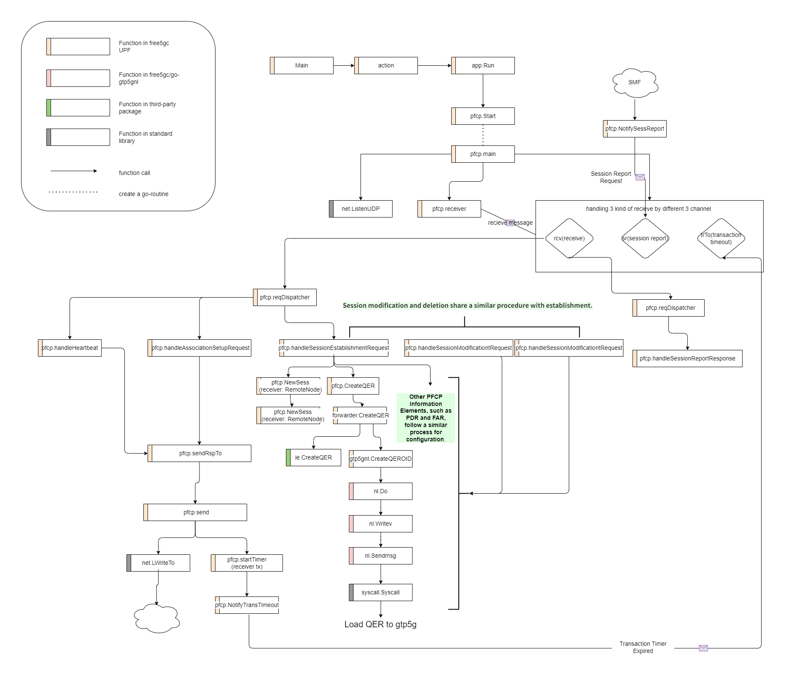

# PFCP Software Architecture within UPF
>
>[!NOTE]
> Author: Ian Cai
> Date: 2024/03/20

## Introduction

The evolution of mobile networks towards 5G introduces the concept of Control and User Plane Separation. This separation aims to improve scalability, flexibility, and performance by isolating control functions (managing network resources and connections) from user plane functions (processing and forwarding user data). However, for optimal network operation, these separated planes still need to communicate effectively.

This communication need is addressed by the Packet Forwarding Control Protocol (PFCP). PFCP acts as a dedicated signaling protocol that sits on top of the UDP/IP transport layer, operating exclusively within the control plane. It facilitates communication between a Control Plane Node, typically the Session Management Function (SMF), and one or more User Plane Nodes, such as User Plane Function (UPF).

PFCP empowers SMFs to establish associations with UPFs, essentially creating control paths for directing user data traffic. Following association, SMF leverage PFCP to configure Packet Data Unit (PDU) sessions within the UPF. These PDU sessions dictate how user data should be processed and forwarded across the network.


## Processing Procedure

The following diagram illustrates the flow of PFCP message processing within the UPF in the free5gc implementation:


The ```app.Run``` function in the free5gc UPF codebase initiates two key processes:

- Data Plane Forwarder for GTP-U: This process establishes a data path for forwarding user data packets between the UPF and the UE (User Equipment) via the GTP-U (GPRS Tunneling Protocol User Plane) protocol.

- PFCP Server: This process establishes a control plane connection with the SMF  using the PFCP protocol.

### PFCP server

The ```pfcp.Start``` function in the free5gc UPF codebase initiates the PFCP server and establishes a listening UDP socket for receiving PFCP messages from the SMF. The ```pfcp.main``` function uses the golang select statement to monitor three channels: 

1. **session report**: The ```pfcp.NotifySessReport``` function is called by the SMF to send session report through this channel
2. **receive packet**: The ```pfcp.receiver ``` function parses the UDP message and then sends the data through this channel.
3. **transaction timeout**:Any packet sent by UPF will start a timeout timer, when timer expires，```pfcp.NotifyTransTimeout``` will send a signal through this channel to trigger re-transmission.

### Association Request

When the UPF  receives an association request sent by the SMF,the ```pfcp.main``` function calls ```pfcp.reqDispatcher```. This dispatcher assigns ```pfcp.handleAssociationSetupRequest``` to handle it. ```pfcp.handleAssociationSetupRequest``` verifyies the  address in the request and adds it to the "remote note list"before sending response to the SMF.

### PDU Session Request

Since the procedures for PDU session modification and deletion are similar to the establishment procedure, I'll use the establishment process as an example to illustrate the overall flow.

When the UPF  receives an PDU session extablishment request sent by the SMF,the ```pfcp.main``` function calls ```pfcp.reqDispatcher```. This dispatcher assigns ```pfcp.handleSessionEstablishmentRequest``` function to handle it. The function  ```pfcp.handleSessionEstablishmentRequest``` first checks whether the remote node ID has been associated with UPF, then proceeds to use the F-SEID in the request to create a PDU session in UPF control plane. Afterwards, the UPF begins creating PDU session in the data plane, by transferring information elements from the PFCP message, such as QER, FAR, and PDR, to the kernel module gtp5g. Taking QER as example, UPF call ```pfcp.CreateQER```, which then calls ```forwarder.CreateQER``` with the purpose of providing the GTP-U driver with the QER value. Subsequently, forwarder.CreateQER utilizes the ```gtp5gnl.CreateQEROID``` function to establish a link with the go-gtp5gnl library. The handler within go-gtp5gnl interacts with the gtp5g module in the kernel through Linux netlink to inject the QER data. This procedure enables the data plane to enforce QoS rules within the PDU session.

## Reference

*3GPP TS 29.244* : Interface between the Control Plane and the User Plane nodes


## About Me

I'm a graduate student at NYCU studying 5G core networks. As I'm a beginner in this field, I'd be grateful for any advice you can offer.

- GitHub: [https://github.com/ian60509](https://github.com/ian60509)