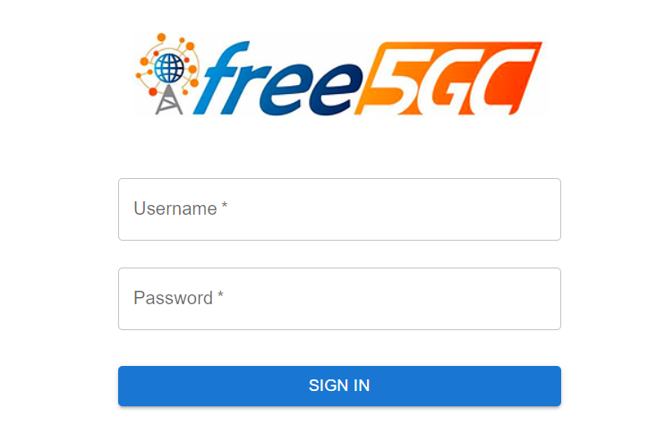
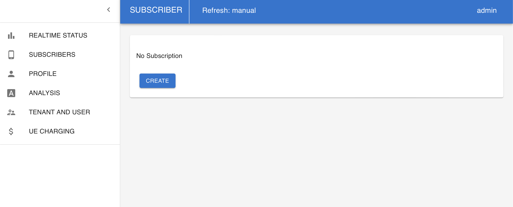
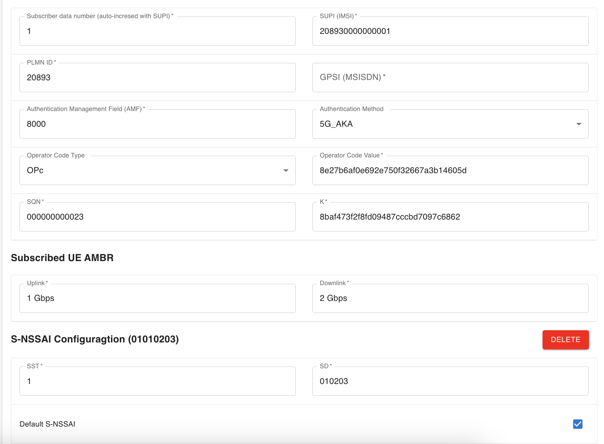
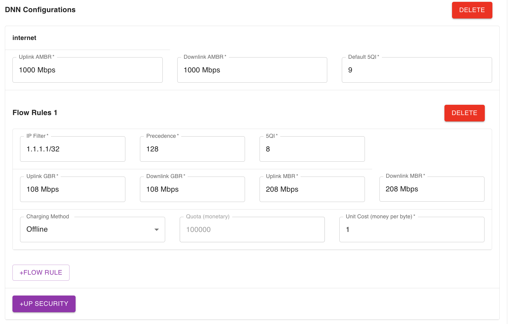
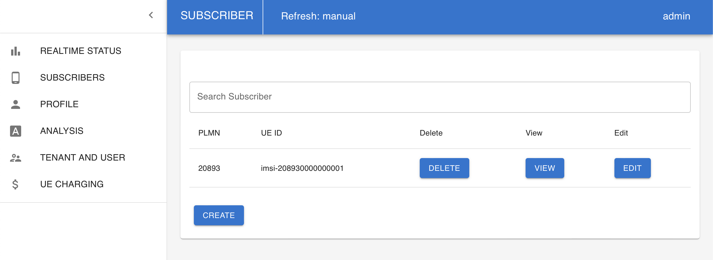
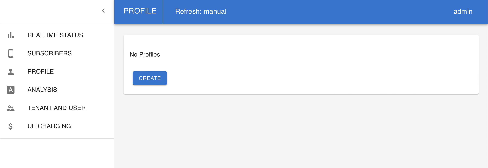
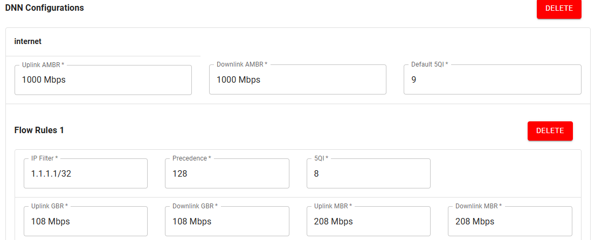
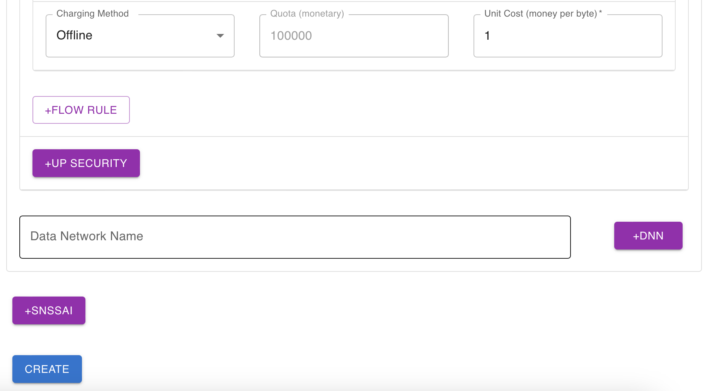
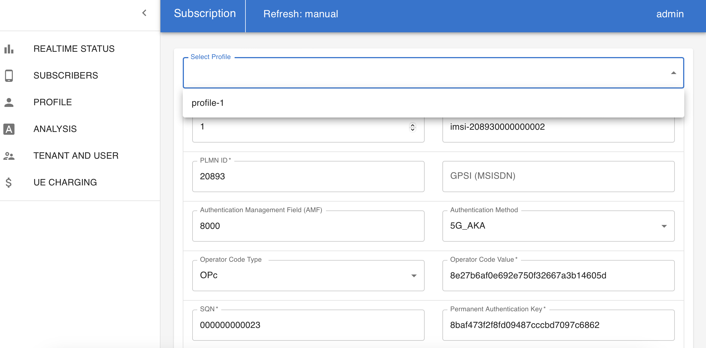
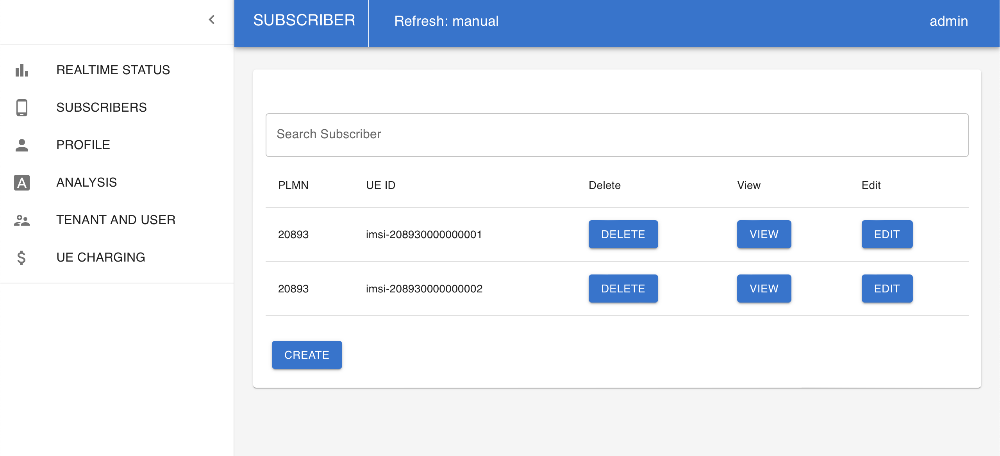

<!-- Google tag (gtag.js) --> <script async src="https://www.googletagmanager.com/gtag/js?id=G-JETJ7TJ805"></script> <script> window.dataLayer = window.dataLayer || []; function gtag(){dataLayer.push(arguments);} gtag('js', new Date()); gtag('config', 'G-JETJ7TJ805'); </script>

# Create Subscriber via Webconsole

## 1. Install Webconsole

If Webconsole isn't installed yet, please, follow the instructions from [GitHub page](https://github.com/free5gc/webconsole).

## 2. (Optional) Delete MongoDB database

If another version of free5GC was ran before, you have to delete MongoDB.
```
$ mongo --eval "db.dropDatabase()" free5gc
```

## 3. Run Webconsole server
```
$ cd ~/free5gc/webconsole
$ go run server.go
```

## 4. Open Webconsole
Enter URL: `<Webconsole server's IP>:5000` in browser



Default credential:
```
Username: admin
Password: free5gc
```

## 5. Add new subscriber

There are two options to add a new subscriber:

- Directly create subscriber in create subscriber page
- Create profile first, then create subscriber with the profile

### 5.1. Directly create subscriber in create subscriber page

> Click `SUBSCRIBERS` -> `CREATE`



> Edit the Subscriber's data and click `CREATE`, here you can configure the 

- **Network Slicing** Configuration
    - SST/SD (Slice/Service Type and Slice Differentiator)
    - **DNN** (Data Network Name) Configuration
        - AMBR (Aggregate Maximum Bit Rate)
            - Maximum total uplink/downlink bitrate limits
        - Default 5QI (5G QoS Identifier)
            - Default Quality of Service identifier
            - GBR type (5QI values: 1-4, 65-67, 71-76)
            - Non-GBR type (5QI values: 5-9, 69-70, 79-80)
        - **Flow** Configuration
            - IP Filter
                - Source/destination IP address ranges
                - CIDR Format (eg: "140.113.0.0/16") 
            - Precedence
                - Priority of flow rules (lower value means higher priority)
            - 5QI (Flow-specific QoS identifier)
                - Non-GBR flows: Best effort traffic, no bandwidth guarantee
                - GBR flows: Guaranteed bit rate for specific services
            - Uplink GBR/MBR (Guaranteed/Maximum Bit Rate)
                - Applicable for GBR 5QI flows
            - Downlink GBR/MBR (Guaranteed/Maximum Bit Rate)
                - Applicable for GBR 5QI flows
            - [Flow-Based Charging Config](../Charging/setting.md)




> Check that the new subscriber was added successfully



### 5.2. Create profile first, then create subscriber with the profile

- Profile is a pre-configured data, which can be used to create multiple subscribers with the same data quickly.
- For these basic subscriber information, please remember to customize them in the `CREATE SUBSCRIBER` page:
  - Subscriber data number
  - SUPI (IMSI)
  - PLMNID
  - GPSI (MSISDN)
  - Authentication Management Field (AMF)
  - Authentication Method
  - Operator Code Type
  - Operator Code Value
  - SQN
  - Permanent Authentication Key

> Click `PROFILE` -> `CREATE`



> Edit the Profile's data and click `CREATE`





> Check that the new profile was added successfully


> Click `SUBSCRIBERS` -> `CREATE`

> Click `SELECT PROFILE` -> Select the profile you just created and customize some basic subscriber information -> `CREATE`



> Check that the new subscriber was added successfully

