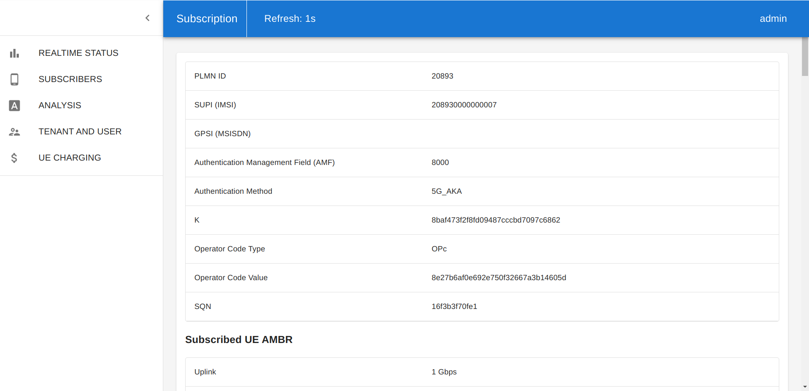
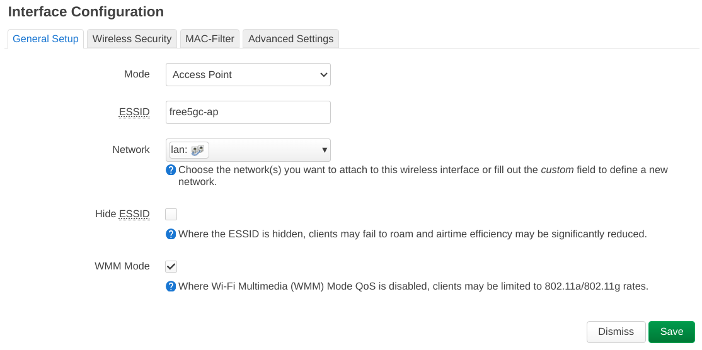
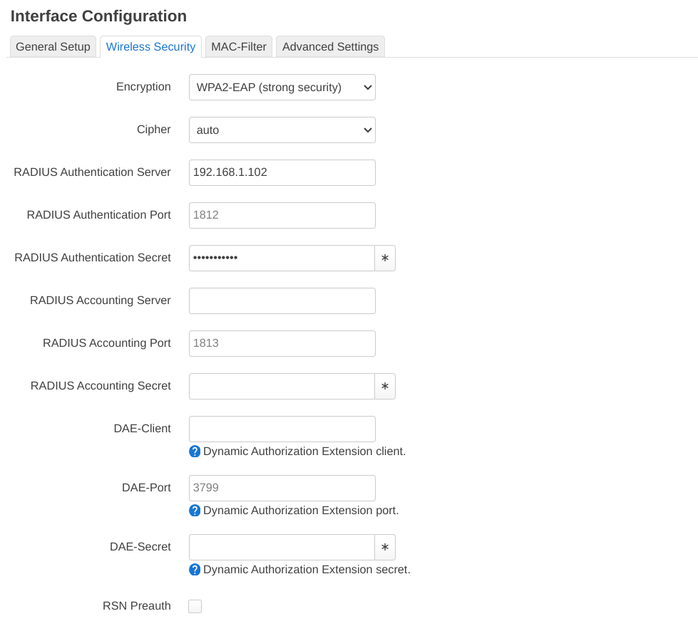
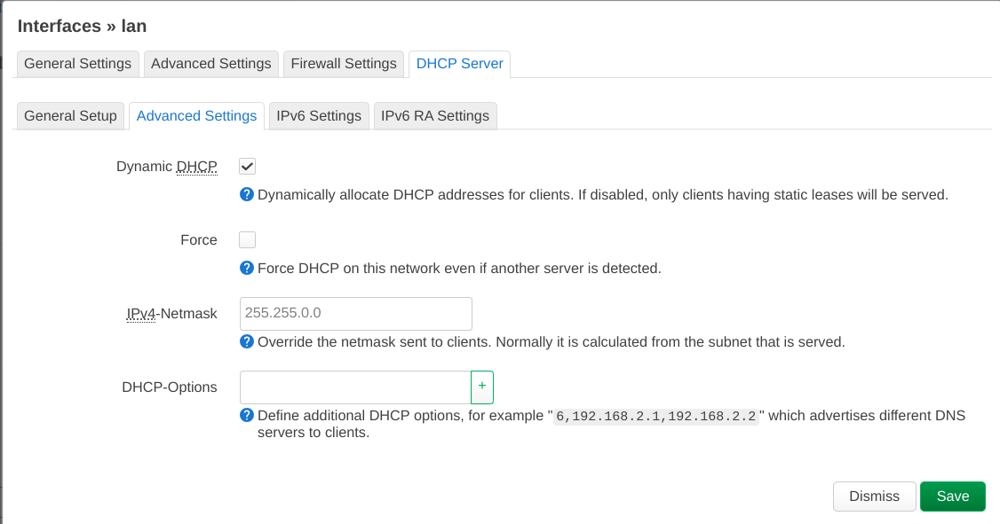

<!-- Google tag (gtag.js) --> <script async src="https://www.googletagmanager.com/gtag/js?id=G-JETJ7TJ805"></script> <script> window.dataLayer = window.dataLayer || []; function gtag(){dataLayer.push(arguments);} gtag('js', new Date()); gtag('config', 'G-JETJ7TJ805'); </script>

## 1. free5GC installation
(Optional) If you install free5GC in a VM, add a network adapter set to bridged mode, and set the card name to your AP.

#### Follow the tutorial in free5GC official site: 
- [Installing free5GC and webconsole](https://free5gc.org/guide/3-install-free5gc/)


### Configuration for NFs
Modify `~/free5gc/config/tngfcfg.yaml` file
```yaml
# --- Bind Interfaces ---
IKEBindAddress: <YOUR_FREE5GC_IP> # IP address of Nwu interface (IKE) on this TNGF
RadiusBindAddress: <YOUR_FREE5GC_IP> #192.168.137.103 # IP address of Nwu interface (IKE) on this TNGF
```

## 2. Use WebConsole to Add UE
* Start your webconsole server
    ```
    cd ~/free5gc/webconsole/
    ./bin/webconsole
    ```
* Open your web browser from your host machine, and enter the URL `http://<FREE5GC_IP>:5000`
* On the login page, enter username `admin` and password `free5gc`
* Go to `SUBSCRIBERS` and click on `CREATE`
* Check `SUPI(IMSI)` field is unique and modify other fields whatever you need

* Scroll all the way down and click on `CREATE`.

## 3. AP setting

#### Setting ESSID
> **Network → Wireless → Edit → Interface Configuration → General Setup**
> 

#### Setting as below, RADIUS Authentication Server is free5gc IP
> **Interface Configuration → Wireless Security**
> 
> 

#### Open Dynamic DHCP
> **Network → Interface → Edit lan →  DHCP server → Advance Setting**
> 

## 4. TNGFUE Installation
Install TNGFUE in another wireless device.
### Get Source Code
```
git clone https://github.com/free5gc/tngfue.git
cd tngfue
```

### TNGFUE Configuration

#### Build/Compile Configuration

Go to `wpa_supplicant/`
```
cd wpa_supplicant
```

Check EAP_VENDOR_TEST option is true *(y)* in `.config` file
```
CONFIG_EAP_VENDOR_TEST=y
```

#### TNGFUE Settings

Modify `~/tngfue/wpa_supplicant.conf`


- `ssid:` your ap/wifi name 
(same as the AP setting part)
- `identity:` identity information for this ue 
(set whatever you want)
- `password:` wifi/ap password
(same as the AP setting part)

```
ctrl_interface=udp
update_config=1
network={
    ssid="<YOUR_AP_NAME>"
    key_mgmt=WPA-EAP
    eap=VENDOR-TEST IKEV2
    identity="<YOUR_IDENTITY_INFO>"
    password="<YOUR_PASSWORD>"
}
```

E.g.
```
ctrl_interface=udp
update_config=1
network={
    ssid="free5gc-ap"
    key_mgmt=WPA-EAP
    eap=VENDOR-TEST IKEV2
    identity="tngfue"
    password="free5gctngf"
}
```

#### Security Parameters
In ```tngfue/wpa_supplicant/sec.conf```:

- `wifiifname:` your wifi interface name 
(you can find this by typing `ifconfig` in terminal)

You can find all the parameters listed below on the Web Console subscriber page.

- `K:` 
- `imsi_identity:` SUPI(IMSI)
- `MSIN:` SUPI without the PLMN part
- `SQN:`
- `AMF:` Authentication Management Field
- `OPC:` Operator Code Value

Format: 
```
wifiifname: <YOUR_WIFI_INTERFACE_NAME>
K:<UE_K_IN_WEBCONSOLE>
imsi_identity:<UE_SUPI_IN_WEBCONSOLE>
nai_username:type0.rid61695.schid0.userid<MSIN>
SQN:<UE_SQN_IN_WEBCONSOLE>
AMF:<AMF_IN_WEBCONSOLE>
OPC:<UE_OPCV_IN_WEBCONSOLE>
```

E.g.
```
wifiifname:wlp3s0
K:8baf473f2f8fd09487cccbd7097c6862
imsi_identity:208930000000007
nai_username:type0.rid61695.schid0.userid000000000007
SQN:16f3b3f70fe1
AMF:8000
OPC:8e27b6af0e692e750f32667a3b14605d
```

#### Build binary
```
cd ~/tngfue/wpa_supplicant/
make
```

**Trouble shooting: Missing packages when building binary**

Update Packages source before installing packages!
```
sudo apt-get update
```

openssl/ssl.h: No such file or directory
```
sudo apt-get install libssl-dev
```
dbus/dbus.h: No such file or directory
```
sudo apt-get install libdbus-1-dev
```
netlink/netlink.h: No such file or directory
```
sudo apt-get install libnl-3-dev
```
/usr/bin/ld: cannot find -lnl-genl-3
```
sudo apt-get install libnl-genl-3-dev
```
/usr/bin/ld: cannot find -lnl-route-3
```
sudo apt-get install libnl-route-3-dev
```

## 5. Testing
### A. Run free5GC with tngf
```
cd ~/free5gc
./run.sh -tngf
```
### B. Run tngfue
#### Make sure xfrm and greTun0 is not exist
> If you don't have a successful connection with TNGF before, you can just skip this step.

Delete two interfaces
```
sudo ip l del greTun0
sudo ip l del xfrm-1
```
#### Set wifi interface IP to the same LAN with free5GC
```
ip a add 192.168.1.202/24 brd 192.168.1.255 dev <YOUR_WIFI_INTERFACE_NAME>
ip r add default via 192.168.1.202 dev <YOUR_WIFI_INTERFACE_NAME>
```
#### Run
```
cd ~/tngfue/wpa_supplicant
sudo ./wpa_supplicant -c ../wpa_supplicant.conf -i <YOUR_WIFI_INTERFACE_NAME> -dd
```

When the session connects successfully, you will see these five interfaces established. 


### C. Transfer data over the greTun0 interface

```
ping -I greTun0 8.8.8.8
```
